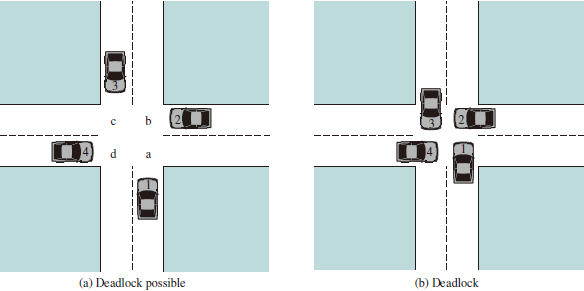
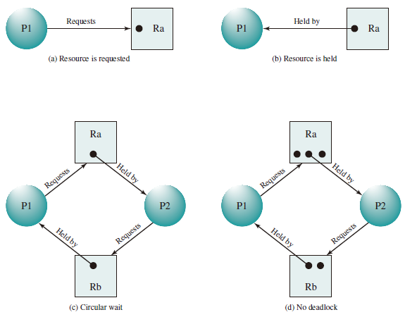

# Deadlock and Starvation

Deadlock can be defined as the permanent blocking of a set of processes that either compete for system resources or communicate with each other. A set of processes is deadlocked when each process in the set is blocked awaiting an event (typically the freeing up of some requested resource) that can only be triggered by another blocked process in the set. Deadlock is permanent because none of the events is ever triggered. Unlike other problems in concurrent process management, there is no efficient solution in the general case.
Illustration of Deadlock:

死锁问题：由于竞争资源或者通信关系，两个或更多线程在执行中出现，永远相互等待只能由其他进程引发的事件。

## General Categories of Resources

### Reusable Resource

* 资源不能被删除且在任何时刻只能有一个进程使用

* 进程释放资源后，其他进程可以重用

### Consumable Resource

* 资源的创建和销毁（I/O 缓冲区的中断、信号、信息等）
* 可能出现死锁

## Resource Allocation Graphs

A useful tool in characterizing the allocation of resources to processes is the resource allocation graph.The resource allocation graph is **a directed graph** that depicts a state of the system of resources and processes, with **each process and each resource represented by a node**. **A graph edge directed** from a process to a resource **indicates a resource that has been requested by the process but not yet granted**. Within a resource node, a dot is shown for each instance of that resource.

## The Conditions for Deadlock

1. Mutual exclusion. Only one process may use a resource at a time. No process may access a resource unit that has been allocated to another process.
2. Hold and wait. A process may hold allocated resources while awaiting assignment of other resources.
3. No preemption. No resource can be forcibly removed from a process holding it.
4. Circular wait. A closed chain of processes exists, such that each process holds at least one resource needed by the next process in the chain

## Deadline Avoidance

* Deadlock Prevention： 确保系统永远不会进入死锁状态。
* Deadlock Avoidance：在使用前进行判断，只允许不会出现死锁的进程请求资源
* Deadlock Detection & Recovery：在检测到运行系统进入死锁状态后，进行恢复
* 安全状态和死锁的关系：
  * 系统处于安全状态，一定没有死锁
  * 系统处于不安全状态，可能出现死锁
    * 避免死锁就是确保系统不会进入不安全状态

## Banker's Algorithm

### Process Initiation Denial

Consider a system of $n$ processes and $m$ different types of resources. Let us define the following vectors and matrices:

* Resource $R = (R_1, R_2, \ldots, R_m)$. Total amount of each resource in the system.
* Available $V = (V_1, V_2, \ldots, V_m)$. Total amount of each resource not allocated to any process.
* Claim $C =\left(\begin{array}{cccc}C_{11} & C_{12} & \ldots & C_{1 m} \\ C_{21} & C_{22} & \ldots & C_{2 m} \\ \vdots & \vdots & \vdots & \vdots \\ C_{n 1} & C_{n 2} & \ldots & C_{n m}\end{array}\right)$. $C_{ij}$ = requirement of process $i$ for resource $j$.
* Allocation $A=\left(\begin{array}{cccc}A_{11} & A_{12} & \ldots & A_{1 m} \\ A_{21} & A_{22} & \ldots & A_{2 m} \\ \vdots & \vdots & \vdots & \vdots \\ A_{n 1} & A_{n 2} & \ldots & A_{n m}\end{array}\right)$. $A_{ij}$ = current allocation to process $i$ of resource $j$.

The following relationships hold:

1. $R_j =V_j + \sum \limits_{i=1}^nA_{ij}$, for all $j$: All resources are either available or allocated.

2. $C_{ij} \leq R_j$, for all $i, j$: No process can claim more than the total
amount of resources in the system.

3. $A_{ij} \leq C_{ij}$, for all $i, j$: No process is allocated more resources of any type than the process originally claimed to need.

With these quantities defined, we can define **a deadlock avoidance policy** that refuses to start a new process if its resource requirements might lead to deadlock. Start a new process $P_{n+1}$ only if
$$R_j \geq C_{(n+1)j} + \sum_{i=1}^nC_{ij}, \textnormal{for all} \space j$$

### Resource Allocation Denial
