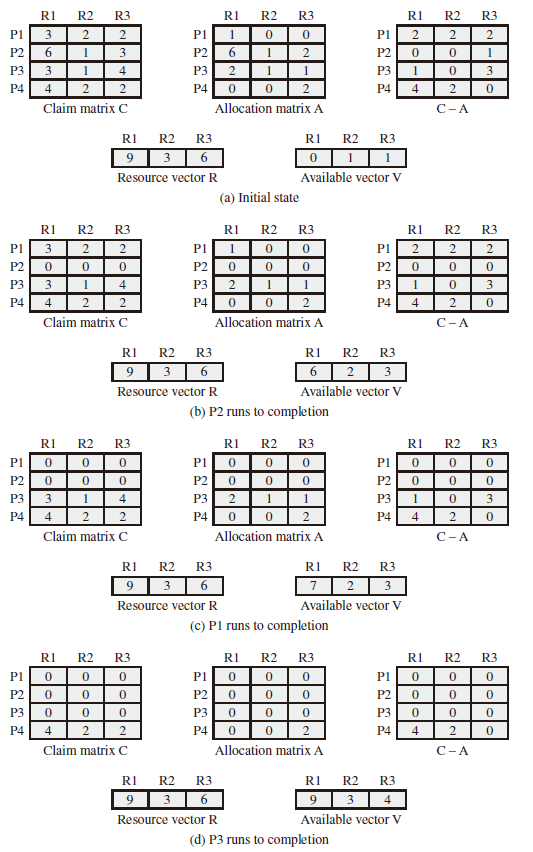
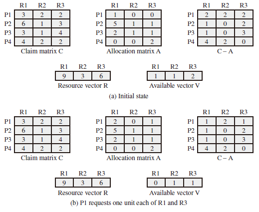
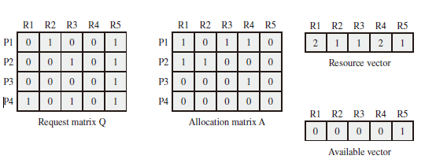
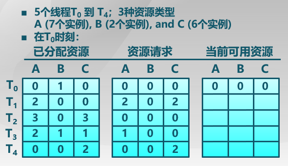
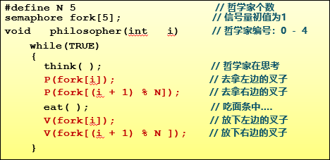
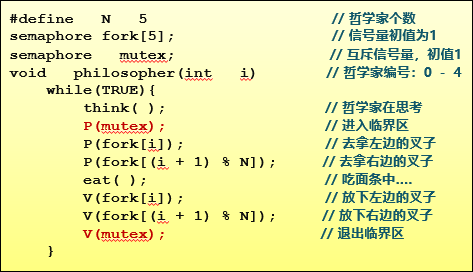
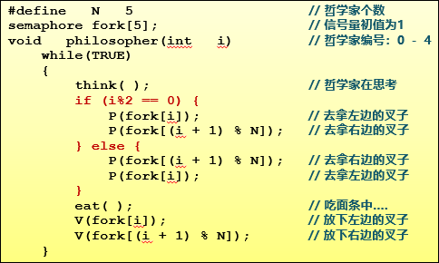
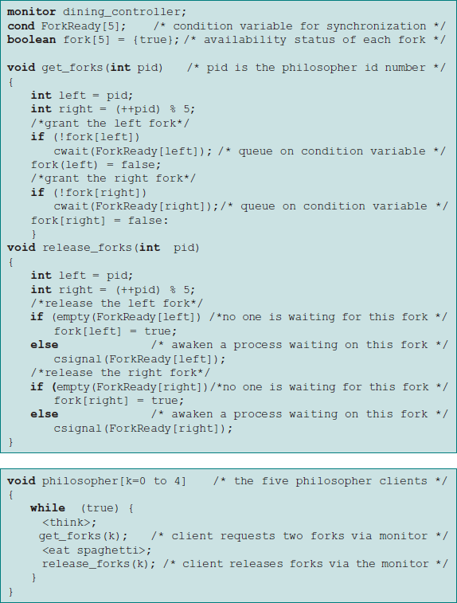

# Deadlock and Starvation

Deadlock can be defined as the permanent blocking of a set of processes that either compete for system resources or communicate with each other. A set of processes is deadlocked when each process in the set is blocked awaiting an event (typically the freeing up of some requested resource) that can only be triggered by another blocked process in the set. Deadlock is permanent because none of the events is ever triggered. Unlike other problems in concurrent process management, there is no efficient solution in the general case.
Illustration of Deadlock:

  

死锁问题：由于竞争资源或者通信关系，两个或更多线程在执行中出现，永远相互等待只能由其他进程引发的事件。

## General Categories of Resources

### Reusable Resource

* 资源不能被删除且在任何时刻只能有一个进程使用

* 进程释放资源后，其他进程可以重用

### Consumable Resource

* 资源的创建和销毁（I/O 缓冲区的中断、信号、信息等）
* 可能出现死锁

## Resource Allocation Graphs

A useful tool in characterizing the allocation of resources to processes is the resource allocation graph.The resource allocation graph is **a directed graph** that depicts a state of the system of resources and processes, with **each process and each resource represented by a node**. **A graph edge directed** from a process to a resource **indicates a resource that has been requested by the process but not yet granted**. Within a resource node, a dot is shown for each instance of that resource.

## The Conditions for Deadlock

1. Mutual exclusion. Only one process may use a resource at a time. No process may access a resource unit that has been allocated to another process.
2. Hold and wait. A process may hold allocated resources while awaiting assignment of other resources.
3. No preemption. No resource can be forcibly removed from a process holding it.
4. Circular wait. A closed chain of processes exists, such that each process holds at least one resource needed by the next process in the chain

## Deadline Avoidance

* Deadlock Prevention： 确保系统永远不会进入死锁状态。
* Deadlock Avoidance：在使用前进行判断，只允许不会出现死锁的进程请求资源
* Deadlock Detection & Recovery：在检测到运行系统进入死锁状态后，进行恢复
* 安全状态和死锁的关系：
  * 系统处于安全状态，一定没有死锁
  * 系统处于不安全状态，可能出现死锁
    * 避免死锁就是确保系统不会进入不安全状态

## Banker's Algorithm

### Process Initiation Denial

Consider a system of $n$ processes and $m$ different types of resources. Let us define the following vectors and matrices:

* Resource $R = (R_1, R_2, \ldots, R_m)$. Total amount of each resource in the system.
* Available $V = (V_1, V_2, \ldots, V_m)$. Total amount of each resource not allocated to any process.
* Claim $C =\left(\begin{array}{cccc}C_{11} & C_{12} & \ldots & C_{1 m} \\ C_{21} & C_{22} & \ldots & C_{2 m} \\ \vdots & \vdots & \vdots & \vdots \\ C_{n 1} & C_{n 2} & \ldots & C_{n m}\end{array}\right)$. $C_{ij}$ = requirement of process $i$ for resource $j$.
* Allocation $A=\left(\begin{array}{cccc}A_{11} & A_{12} & \ldots & A_{1 m} \\ A_{21} & A_{22} & \ldots & A_{2 m} \\ \vdots & \vdots & \vdots & \vdots \\ A_{n 1} & A_{n 2} & \ldots & A_{n m}\end{array}\right)$. $A_{ij}$ = current allocation to process $i$ of resource $j$.

The following relationships hold:

1. $R_j =V_j + \sum \limits_{i=1}^nA_{ij}$, for all $j$: All resources are either available or allocated.

2. $C_{ij} \leq R_j$, for all $i, j$: No process can claim more than the total
amount of resources in the system.

3. $A_{ij} \leq C_{ij}$, for all $i, j$: No process is allocated more resources of any type than the process originally claimed to need.

With these quantities defined, we can define **a deadlock avoidance policy** that refuses to start a new process if its resource requirements might lead to deadlock. Start a new process $P_{n+1}$ only if
$$R_j \geq C_{(n+1)j} + \sum_{i=1}^nC_{ij}, \textnormal{for all} \space j$$

### Resource Allocation Denial

* A safe state is one in which there is at **least one sequence of resource allocations to processes that does not result in a deadlock** (i.e., all of the processes can be run to completion).

* An unsafe state is, of course, a state that is not safe.

In terms of the matrices and vectors introduced earlier, the condition to be met for process $i$ is:
$$C_{ij} - A_{ij} \leq V_{j}, \textnormal{for all} \space j$$
Safe State:  

Unsafe State:  

It is unsafe because each process will need at least one additional unit of R1, and there are none available. Thus, on the basis of deadlock avoidance, the request by P1 should be denied and P1 should be blocked. **It is important to point out that Figure (b) is not a deadlocked state. It merely has the potential for deadlock.** If P1 were run from this state, it would subsequently release one unit of R1 and one unit of R3 prior to needing these resources again. If that happened, the system would return to a safe state.

Thus, the deadlock avoidance strategy does not predict deadlock with certainty; it merely anticipates the possibility of deadlock and assures that there is never such a possibility.

### Deadlock Detection

The Allocation matrix and Available vector described in the previous section are used. In addition, a request matrix $Q$ is defined such that $Q_{ij}$ represents the amount of resources of type $j$ requested by process $i$.

The algorithm proceeds by **marking processes that are not part of a deadlocked set**. Initially, all processes are unmarked. Then the following steps are performed:

1. **Mark each process that has a row in the Allocation matrix of all zeros.** A process that has no allocated resources cannot participate in a deadlock.
2. Initialize a temporary vector $W$ to equal the Available vector.
3. Find an index $i$ such that process $i$ is currently unmarked and the *i*th row of $Q$ is less than or equal to $W$. That is, $Q_{ik} \leq W_{k}$, for $1 \leq k \leq m$. If no such row is found, terminate the algorithm.
4. If such a row is found, mark process $i$ and add the corresponding row of the allocation matrix to $W$. That is, set $W_k = W_k + A_{ik}$, for $1 \leq k \leq m$. Return to step 3.

#### Example I

1. Mark P4, because P4 has no allocated resources.
2. Set $W=(0 \space 0 \space 0 \space 0 \space 1)$
3. The request of process P3 is less than or equal to $W$, so mark P3 and set
$$W=W+(0 \space 0 \space 0 \space 1 \space 0) = (0 \space0 \space0 \space1 \space 1)$$
4. No other unmarked process has a row in Q that is less than or equal to W.
Therefore, terminate the algorithm.

The algorithm concludes with P1 and P2 unmarked, indicating these processes
are deadlocked.

#### Example II

1. 由于已分配进程中找不到全 0 向量，所以不能 mark。
2. 计算 $W$ 向量为全 0。
3. T0 的资源请求 $Q_0$ 向量 小于等于 $W$，$W = W + A_0 = (0 \space 1 \space 0)$
4. T2 的资源请求 $Q_2$ 向量 小于等于 $W$，$W = W + A_2 = (3 \space 1 \space 3)$
4. T3 的资源请求 $Q_3$ 向量 小于等于 $W$，$W = W + A_3 = (5 \space 2 \space 4)$
5. T4 的资源请求 $Q_4$ 向量 小于等于 $W$，$W = W + A_4 = (5 \space 2 \space 6)$
6. T1 的资源请求 $Q_1$ 向量 小于等于 $W$，$W = W + A_1 = (7 \space 2 \space 6)$

因此执行序列 T0, T2, T3, T4, T1 合法。

### Deadlock Recovery

Once deadlock has been detected, some strategy is needed for recovery. The following are possible approaches, listed in the order of increasing sophistication:

1. Abort all deadlocked processes.
2. Back up each deadlocked process to some previously defined checkpoint, and restart all processes.
3. Successively abort deadlocked processes until deadlock no longer exists.
4. Successively preempt resources until deadlock no longer exists.

## Dining Philosophers Problem

* 5个哲学家围绕一张圆桌而坐
  * 桌子上放着5支叉子
  * 每两个哲学家之间放一支
* 哲学家的动作包括思考和进餐
  * 进餐时需同时拿到左右两边的叉子
  * 思考时将两支叉子放回原处
  
如何保证哲学家们的动作有序进行？如：不出现有人永远拿不到叉子

### Solution 1

  
不正确，五个人同时拿左边的叉子，所有人的右边都没有叉子了（死锁）。

### Solution 2

  
互斥访问正确，但每次只允许一人进餐。

### Solution Three

  
没有死锁，可有多人同时就餐。

### A Solution Using a Monitor

