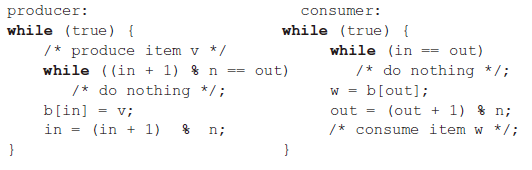
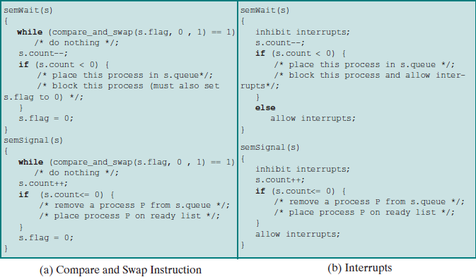
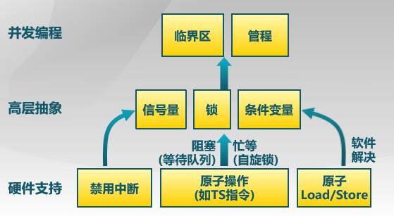
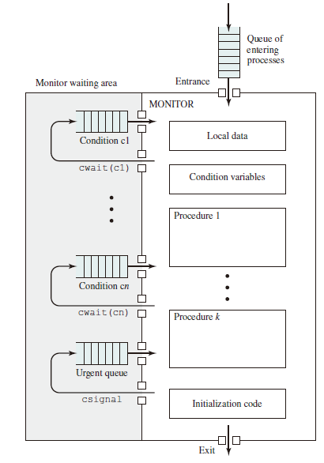
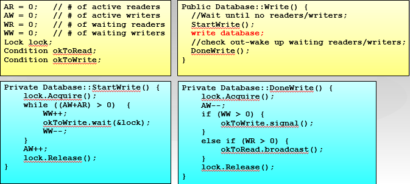
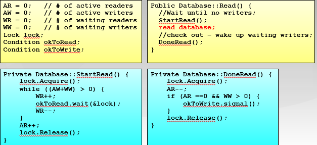

# Semaphore

## Key Terms

* Semaphore: An integer value used for signaling among processes. Only three operations may be
performed on a semaphore, all of which are **atomic**: **initialize, decrement, and increment**. The decrement operation may result in the blocking of a process, and the increment
operation may result in the unblocking of a process. Also known as a counting
semaphore or a general semaphore.

* Binary semaphore: A semaphore that takes on only the **values 0 and 1**.

* Mutex: Similar to a binary semaphore. A key difference between the two is that **the process that locks the mutex (sets the value to 0) must be the one to unlock it (sets the value to 1)**.
* Condition variable: A data type that is used to block a process or thread until a particular condition is true.
* Monitor: A programming language construct that **encapsulates variables, access procedures, and
initialization code within an abstract data type**. The monitor’s variable may only be accessed via its access procedures and **only one process may be actively accessing the monitor at any one time**. The access procedures are critical sections. A monitor may have a queue of processes that are waiting to access it.
* Event flags: A memory word used as a synchronization mechanism. Application code may associate a different event with each bit in a flag. A thread can wait for either a single event or a combination of events by checking one or multiple bits in the corresponding flag. The thread is blocked until all of the required bits are set (AND) or until at least one of the bits is set (OR).
* Mailboxes/messages: A means for two processes to exchange information and that may be used for synchronization.
* Spinlocks: Mutual exclusion mechanism in which a process executes in an infinite loop waiting for the value of a lock variable to indicate availability.

**Notice that*:*

* A mutex can be released only by the thread that had acquired it.
* A binary semaphore can be signaled by any thread (or process).

## Introduction

信号量是操作系统提供的一种协调共享资源访问的方法，由一个整形（sem）变量和两个原子操作组成。

* P()：减少
  * sem -1
  * 若 sem <0，进入等待，否则继续
* V()：增加
  * sem +1
  * 若 sem $\leq$ 0，则唤醒一个进程

* 信号量是**被保护**的整数变量：初始化完成后，只能通过 P()，V() 进程修改且 PV 是原子操作。
* P() 可能阻塞，V() 不会阻塞

For signaling, special variables called semaphores are used.

* To transmit a signal via semaphore s, a process executes the primitive semSignal (s).
* To receive a signal via semaphore s, a process executes the primitive semWait (s); if the corresponding signal has not yet been transmitted, the process is suspended until the transmission takes place.

To achieve the desired effect, we can view the semaphore as a variable that has an integer value upon which only three operations are defined:

1. A semaphore may be initialized to a nonnegative integer value.
2. The semWait operation decrements the semaphore value. If the value becomes negative, then the process executing the semWait is blocked. Otherwise, the process continues execution.
3. The semSignal operation increments the semaphore value. If the resulting value is less than or equal to zero, then a process blocked by a semWait operation, if any, is unblocked.

```c++
struct semaphore {
    int count;
    queueType queue;
};
void semWait(semaphore s) // P 操作
{
    s.count--;
    if (s.count < 0) {
    /* place this process in s.queue */;
    /* block this process */;
    }
}
void semSignal(semaphore s) { // V 操作
    s.count++;
    if (s.count<= 0) {
    /* remove a process P from s.queue */;
    /* place process P on ready list */;
    }
}
```

## Categories

* Binary Semaphore, may only take on the value 0 and 1.
  * Three Operations:
    1. binary semaphore may be initialized to 0 or 1.
    2. The `semWaitB` operations checks the semaphore value. If the value is zero, then the process executing the `semWaitB` is blocked.
    3. The `semSignalB` operation checks to see if any processes are blocked on this semaphore (semaphore value equals 0). If so, then a process blocked by a `semWaitB` operation is unblocked. If no processes are blocked, then the value of the semaphore is set to one.

      ```c++
      struct semaphore {
        int count;
        queueType queue;
      };
      void semWait(semaphore s){
        s.count--;
        if (s.count < 0) {
          /*place this process in s.queue*/;
          /*block this process*/;
        }
      }
      void semSignal(semaphore s) {
        s.count++;
        if (s.count<= 0) {
          /*remove a process P from s.queue*/;
          /*place process P on ready list*/;
        }
      }
      ```

* The nonbinary semaphore is often referred to as either a counting semaphore or a general semaphore.

## Applications

### Mutual Exclusion

每个 Critical Section 设置一个信号量，初值为 1。

* Consider n processes, identified in the array P(i), all of which need access to the same resource. Each process has a critical section
used to access the resource.
* In each process, a semWait (s) is executed just before its critical section.
* If the value of s becomes negative, the process is blocked. If the value is 1, then it is decremented to 0 and the process immediately enters its critical section.

```c++
/* program mutualexclusion */
const int n = /* number of processes */;
semaphore s = 1;
void P(int i) {
  while (true) {
    semWait(s);
    /* critical section */;
    semSignal(s);
    /* remainder */;
  }
}
void main() {
  parbegin (P(1), P(2), . . . , P(n));
}
```

必须**成对使用** PV 操作。

### Conditional Synchronization

用信号量实现条件同步：每个条件同步设置一个信号量

```c++
condition = new Semaphore(0);
// Thread A
...M...
condition -> P();
.. N ..

// Thread B
.. X ..
condition -> V();
.. Y ..
```

### The Producer/Consumer Problem

* There are one or more producers generating some type of data (records, characters) and placing these in a buffer.（一个或多个生产者在生成数据后放在一个缓冲区里）
* There is a single consumer that is taking items out of the buffer one at a time.（单个消费者从缓冲区取出数据处理）
* The system is to be constrained to prevent the overlap of buffer operations, that is only one agent (producer or consumer) may access the buffer at any one time.（系统限制同时访问）

The problem is to make sure that the producer won’t try to add data into the buffer if it’s full, and that the consumer won’t try to remove data from an empty buffer.

Note that variable n is the number of items in the buffer and semaphore s is used to enforce mutual exclusion.

```c++
/* program producerconsumer */
semaphore n = 0, s = 1;
void producer() {
  while (true) {
    produce();
    semWait(s);
    append();
    semSignal(s);
    semSignal(n);
  }
}
void consumer() {
  while (true) {
    semWait(n);
    semWait(s);
    take();
    semSignal(s);
    consume();
  }
}
void main() {
  parbegin (producer, consumer);
}
```

Now suppose the semWait (n) and semWait (s) operations are accidentally reversed. This produces a serious, indeed a fatal, flaw. If the consumer ever enters its critical section when the buffer is empty (n.count = 0), then no producer can ever append to the buffer and the system is deadlocked. This is a good example of the subtlety of semaphores and the difficulty of producing correct designs.

Finally, let us add a new and realistic restriction to the producer/consumer problem: namely, that the buffer is finite. The buffer is treated as a circular storage and pointer values must be expressed modulo the size of the buffer. The following relationships hold:
|Block on:|Unblock on:|
|:--:|:--:|
|Producer: insert in full buffer |Consumer: item inserted|
|Consumer: remove from empty buffer| Producer: item removed|
The producer and consumer functions can be expressed as follows (variable in and out are initialized to 0 and n is the size of the buffer):


```c++
/* program boundedbuffer */
const int sizeofbuffer = /* buffer size */;
semaphore s = 1, n = 0, e = sizeofbuffer;
void producer() {
  while (true) {
    produce();
    semWait(e);
    semWait(s);
    append();
    semSignal(s);
    semSignal(n);
  }
}
void consumer() {
  while (true) {
    semWait(n);
    semWait(s);
    take();
    semSignal(s);
    semSignal(e);
    consume();
  }
}
void main() {
  parbegin (producer, consumer);
}
```

#### Implementation of Semaphores



### Monitor


A monitor is a software module consisting of **one or more procedures, an initialization sequence, and local data**. The chief characteristics of a monitor are the following:

1. The local data variables are accessible **only by the monitor’s procedures** and not by any external procedure
2. A process **enters the monitor by invoking one of its procedures**.
3. **Only one process may be executing in the monitor at a time**; any other processes that have invoked the monitor are blocked, waiting for the monitor to become available.

管程是一种用于多线程互斥访问共享资源的程序结构，任一时刻最多只有一个线程执行管程代码。

#### Condition Variable

A monitor supports synchronization by the use of condition variables that are **contained within the monitor and accessible only within the monitor**. Condition variables are a special data type in monitors, which are operated on by two functions:

* `cwait (c)`: Suspend execution of the calling process on condition c. The monitor is now available for use by another process.
* `csignal (c)`: Resume execution of some process blocked after a cwait on
the same condition. If there are several such processes, choose one of them; if there is no such process, do nothing.

Structure of Monitor:


Although a process can enter the monitor by invoking any of its procedures, we can think of the monitor as having **a single entry point** that is guarded so **only one process may be in the monitor at a time**. Other processes that attempt to enter the monitor join a queue of processes blocked waiting for monitor availability.

Once a process is in the monitor, it may temporarily block itself on condition x by issuing cwait (x); it is then placed in a queue of processes waiting to reenter the monitor when the condition changes, and resume execution at the point in its program following the cwait (x) call. If a process that is executing in the monitor detects a change in the condition variable x, it issues csignal (x), which alerts the corresponding condition queue that the condition has changed.

Implementation:

```c++
class Condition {
    int numWaiting = 0;
    WaitQueue q;
}
Condition::Wait(lock){
    numWaiting++;
    Add this thread t to q;
    release(lock);
    schedule(); //need mutex
    require(lock);
}
Condition::Signal(){
    if (numWaiting > 0) {
        Remove a thread t from q;
        wakeup(t); //need mutex
        numWaiting--;
    }
}

```

#### The Producer/Consumer Problem Implemented in Monitor

```c++
/* program producerconsumer */
monitor boundedbuffer;
char buffer [N]; /* space for N items */
int nextin, nextout; /* buffer pointers */
int count; /* number of items in buffer */
cond notfull, notempty; /* condition variables for synchronization */

void append (char x) {
  if (count == N) cwait(notfull); /* buffer is full; avoid overflow */
  buffer[nextin] = x;
  nextin = (nextin + 1) % N;
  count++;
  /* one more item in buffer */
  csignal (notempty); /*resume any waiting consumer */
}
void take (char x) {
  if (count == 0) cwait(notempty); /* buffer is empty; avoid underflow */
  x = buffer[nextout];
  nextout = (nextout + 1) % N;
  count--; /* one fewer item in buffer */
  csignal (notfull); /* resume any waiting producer */
}

monitor()
{ /* monitor body */
  nextin = 0; nextout = 0; count = 0; /* buffer initially empty */
}

void producer() {
  char x;
  while (true) {
    produce(x);
    append(x);
  }
}
void consumer() {
  char x;
  while (true) {
    take(x);
    consume(x);
  }
}
void main() {
  parbegin (producer, consumer);
}
```

### Readers/Writers Problem

The readers/writers problem is defined as follows: There is a data area shared among a number of processes. The data area could be a file, a block of main memory, or even a bank of processor registers. There are a number of processes that only read the data area (readers) and a number that only write to the data area (writers). The conditions that must be satisfied are as follows:

1. Any number of readers may simultaneously read the file.
2. Only one writer at a time may write to the file.
3. If a writer is writing to the file, no reader may read it.

Thus, readers are processes that are not required to exclude one another, and writers are processes that are required to exclude all other processes, readers and writers alike.

#### Writers Have Priority

```c++
/* program readersandwriters */
int readcount,writecount; semaphore x = 1, y = 1, z = 1, wsem = 1, rsem = 1;
void reader() {
  while (true) {
    semWait (z);
    semWait (rsem);
    semWait (x);
    readcount++;
    if (readcount == 1) semWait (wsem);
    semSignal (x);
    semSignal (rsem);
    semSignal (z);
    READUNIT();
    semWait (x);
    readcount--;
    if (readcount == 0) semSignal (wsem);
    semSignal (x);
  }
}
void writer () {
  while (true) {
    semWait (y);
    writecount++;
    if (writecount == 1) semWait (rsem);
    semSignal (y);
    semWait (wsem);
    WRITEUNIT();
    semSignal (wsem);
    semWait (y);
    writecount--;
    if (writecount == 0) semSignal (rsem);
    semSignal (y);
  }
}
void main() {
  readcount = writecount = 0;
  parbegin (reader, writer);
}
```

State of the Process Queues for Program:

* Readers only in the system
  * wsem set
  * no queues
* Writers only in the system
  * wsem and rsem set
  * writers queue on wsem
* Both readers and writers with read first
  * wsem set by reader
  * rsem set by writer
  * all writers queue on wsem
  * one reader queues on rsem
  * other readers queue on z
* Both readers and writers with write first
  * wsem set by writer
  * rsem set by writer
  * writers queue on wsem
  * one reader queues on rsem
  * other readers queue on z



#### Readers Have Priority

```c++
/* program readersandwriters */
int readcount;
semaphore x = 1,wsem = 1;
void reader() {
  while (true) {
    semWait (x);
    readcount++;
    if(readcount == 1) semWait (wsem);
    semSignal (x);
    READUNIT();
    semWait (x);
    readcount--;
    if(readcount == 0) semSignal (wsem);
    semSignal (x);
  }
}
void writer() {
  while (true){
    semWait (wsem);
    WRITEUNIT();
    semSignal (wsem);
  }
}
void main() {
  readcount = 0;
  parbegin (reader,writer);
}
```


