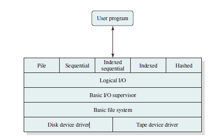
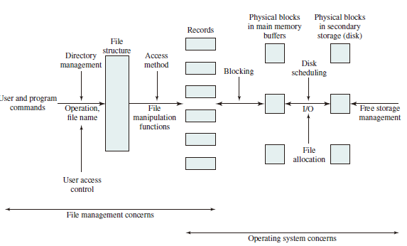
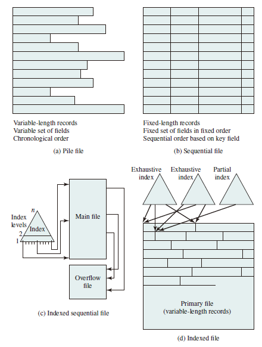

# File System

## Files and File Systems

From the user’s point of view, one of the most important parts of an operating system is the file system. The file system permits users to create data collections, called files, with desirable properties, such as:

* Long-term existence: Files are stored on disk or other secondary storage and do not disappear when a user logs off.
* Sharable between processes: Files have names and can have associated access
permissions that permit controlled sharing.

* Structure: Depending on the file system, a file can have an internal structure that is convenient for particular applications. In addition, files can be organized into a hierarchical or more complex structure to reflect the relationships among files.

Any file system provides not only a means to store data organized as files, but
a collection of functions that can be performed on files. Typical operations include the following:

* Create
* Delete
* Open
* Close
* Read
* Write

## File Structure

Four terms are in common use when discussing files:

### Field

A **field** is the basic element of data. Depending on the file design, fields may be fixed length or variable length. In the latter case, the field often consists of fwo or three subfields: the actual value to be stored, the name of the fields, and in some cases, the length of the field. In other cases of variable-length fields, the length of the field is indicated by the use of special demarcation (boundary) symbols between fields.

### Record

A **record** is a collection of related fields that can be treated as a unit by some application program. A record will
be of variable length if some of its fields are of variable length or if the number of fields may vary. In the latter case, each field is usually accompanied by a field name. In either case, the entire record usually includes a length field.

### File

A **file** is a collection of similar records. The file is treated as a single entity by users and applications and may be referenced by name. Files have file names and may be created and deleted.

### Database

A **database** is a collection of related data. The essential aspects of a database are that the relationships that exist among elements of data are explicit.

## File Management Systems

A file management system is that set of system software that provides services to users and applications in the use of files. Typically, the only way a user or application may access files is through the file management system.  
The following objectives for a file management system are as follows:

* To meet the data management needs and requirements of the user, which include storage of data and the ability to perform the aforementioned operations
* To guarantee, to the extend possible, that the data in the file are valid
* To optimize performance, both from the system point of view in terms of overall throughput, and from the user’s point of view in terms of response time
* To provide I/O support for a variety of storage device types
* To minimize or eliminate the potential for lost or destroyed data
* To provide a standardized set of I/O interface routines to user processes
* To provide I/O support for multiple users, in the case of multiple-user systems

With respect to the first point, meeting user requirements, the extent of such requirements depends on the variety of applications and the environment in which the computer system will be used. For an interactive, general-purpose system, the following constitute a minimal set of requirements:

1. Each user should be able to create, delete, read, write, and modify files.
2. Each user may have controlled access to other users’ files.
3. Each user may control what types of accesses are allowed to the user’s files
4. Each user should be able to move data between files.
5. Each user should be able to back up and recover the user’s files in case of
damage.
6. Each user should be able to access his or her files by name rather than by
numeric identifier.

### File System Architecture

### File Management Functions

## File Organization and Access

In choosing a file organization, several criteria are important:

* Short access time
* Ease of update
* Economy of storage
* Simple maintenance
* Reliability

### Five Fundamental Organizations

1. The pile
2. The sequential file
3. The indexed sequential file
4. The indexed file
5. The direct, or hashed, file

