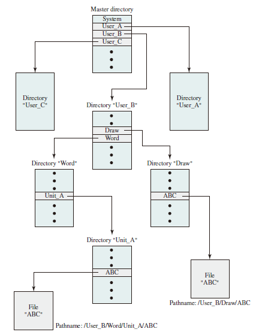

# File System

## Files and File Systems

From the user’s point of view, one of the most important parts of an operating system is the file system. The file system permits users to create data collections, called files, with desirable properties, such as:

* Long-term existence: Files are stored on disk or other secondary storage and do not disappear when a user logs off.
* Sharable between processes: Files have names and can have associated access permissions that permit controlled sharing.

* Structure: Depending on the file system, a file can have an internal structure that is convenient for particular applications. In addition, files can be organized into a hierarchical or more complex structure to reflect the relationships among files.

Any file system provides not only a means to store data organized as files, but a collection of functions that can be performed on files. Typical operations include the following:

* Create
* Delete
* Open
* Close
* Read
* Write

## File Structure

Four terms are in common use when discussing files:

### Field

A **field** is the basic element of data. Depending on the file design, fields may be fixed length or variable length. In the latter case, the field often consists of fwo or three subfields: the actual value to be stored, the name of the fields, and in some cases, the length of the field. In other cases of variable-length fields, the length of the field is indicated by the use of special demarcation (boundary) symbols between fields.

### Record

A **record** is a collection of related fields that can be treated as a unit by some application program. A record will
be of variable length if some of its fields are of variable length or if the number of fields may vary. In the latter case, each field is usually accompanied by a field name. In either case, the entire record usually includes a length field.

### File

A **file** is a collection of similar records. The file is treated as a single entity by users and applications and may be referenced by name. Files have file names and may be created and deleted.

### Database

A **database** is a collection of related data. The essential aspects of a database are that the relationships that exist among elements of data are explicit.

## File Management Systems

A file management system is that set of system software that provides services to users and applications in the use of files. Typically, the only way a user or application may access files is through the file management system.  
The following objectives for a file management system are as follows:

* To meet the data management needs and requirements of the user, which include storage of data and the ability to perform the aforementioned operations
* To guarantee, to the extend possible, that the data in the file are valid
* To optimize performance, both from the system point of view in terms of overall throughput, and from the user’s point of view in terms of response time
* To provide I/O support for a variety of storage device types
* To minimize or eliminate the potential for lost or destroyed data
* To provide a standardized set of I/O interface routines to user processes
* To provide I/O support for multiple users, in the case of multiple-user systems

With respect to the first point, meeting user requirements, the extent of such requirements depends on the variety of applications and the environment in which the computer system will be used. For an interactive, general-purpose system, the following constitute a minimal set of requirements:

1. Each user should be able to create, delete, read, write, and modify files.
2. Each user may have controlled access to other users’ files.
3. Each user may control what types of accesses are allowed to the user’s files
4. Each user should be able to move data between files.
5. Each user should be able to back up and recover the user’s files in case of damage.
6. Each user should be able to access his or her files by name rather than by numeric identifier.

### File System Architecture

### File Management Functions

## File Organization and Access

In choosing a file organization, several criteria are important:

* Short access time
* Ease of update
* Economy of storage
* Simple maintenance
* Reliability

### Five Fundamental Organizations

1. The pile
2. The sequential file
3. The indexed sequential file
4. The indexed file
5. The direct, or hashed, file

## File Directories

### Contents

Associated with any file management system and collection of files is a file directory. The directory contains information about the files, including attributes, location,
and ownership. Much of this information, especially that concerned with storage, is managed by the operating system. The directory is itself a file, accessible by various
file management routines. Although some of the information in directories is available to users and applications, this is generally provided indirectly by system routines.

### Structure

To understand the requirements for a file structure, it is helpful to consider the types of operations that may be performed on the directory:

* Search: When a user or application references a file, the directory must be searched to find the entry corresponding to that file.
* Create file: When a new file is created, an entry must be added to the directory.
* Delete file: When a file is deleted, an entry must be removed from the directory.
* List directory: All or a portion of the directory may be requested. Generally, this request is made by a user and results in a listing of all files owned by that user, plus some of the attributes of each file (e.g., type, access control information,
usage information).
* Update directory: Because some file attributes are stored in the directory, a change in one of these attributes requires a change in the corresponding directory entry.

### Naming

Users need to be able to refer to a file by a symbolic name. Clearly, each file in the system must have a unique name in order that file references be unambiguous. On the other hand, it is an unacceptable burden on users to require they provide unique names, especially in a shared system.  

The use of a tree-structured directory minimizes the difficulty in assigning unique names. Any file in the system can be located by following a path from the root or master directory down various branches until the file is reached. The series of directory names, culminating in the file name itself, constitutes a pathname for the file.

## File Sharing

In a multi-user system, there is almost always a requirement for allowing files to be shared among a number of users. Two issues arise: access rights and the management of simultaneous access.

### Access Rights

The following list is representative of access rights that can be assigned to a particular user for a particular file:

* None: The user may not even learn of the existence of the file, much less access it. To enforce this restriction, the user would not be allowed to read the user directory that includes this file.
* Knowledge: The user can determine that the file exists and who its owner is. The user is then able to petition the owner for additional access rights.
* Execution: The user can load and execute a program but cannot copy it. Proprietary programs are often made accessible with this restriction.
* Reading: The user can read the file for any purpose, including copying and execution. Some systems are able to enforce a distinction between viewing and copying. In the former case, the contents of the file can be displayed to the user, but the user has no means for making a copy.
* Appending: The user can add data to the file, often only at the end, but cannot modify or delete any of the file’s contents. This right is useful in collecting data from a number of sources.
* Updating: The user can modify, delete, and add to the file’s data. This normally includes writing the file initially, rewriting it completely or in part, and removing all or a portion of the data. Some systems distinguish among different degrees of updating.
* Changing protection: The user can change the access rights granted to other users. Typically, this right is held only by the owner of the file. In some systems, the owner can extend this right to others. To prevent abuse of this mechanism, the file owner will typically be able to specify which rights can be changed by the holder of this right.
* Deletion: The user can delete the file from the file system.

One user is designated as the owner of a given file, usually the person who initially created the file. The owner has all of the access rights listed previously and may grant rights to others. Access can be provided to different classes of users:

* Specific user: Individual users who are designated by user ID
* User groups: A set of users who are not individually defined. The system must have some way of keeping track of the membership of user groups.
* All: All users who have access to this system. These are public files.

### Simultaneous Access

When access is granted to append or update a file to more than one user, the operating system or file management system must enforce discipline. A brute-force approach is to allow a user to lock the entire file when it is to be updated. A finer grain of control is to lock individual records during update. Essentially, this is the readers/writers problem. Issues of mutual exclusion and deadlock must be addressed in designing the shared access capability.

## Record Blocking
