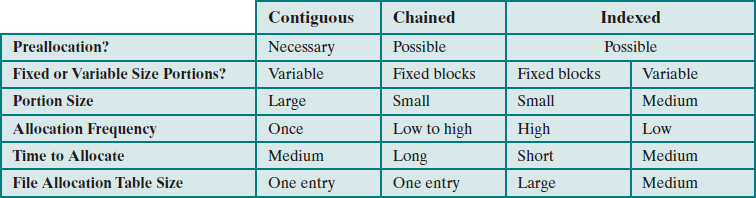
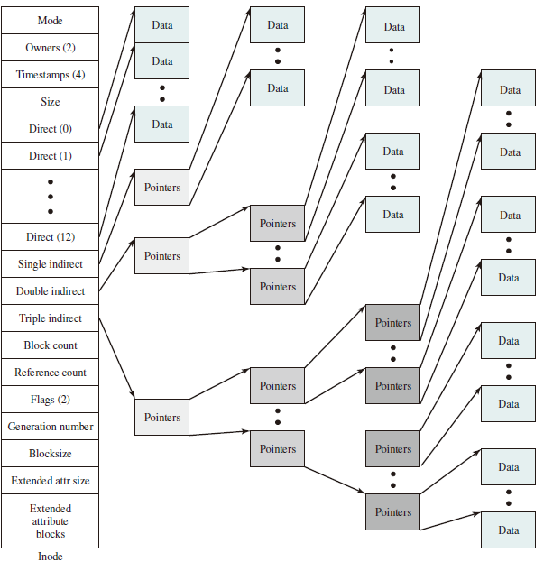
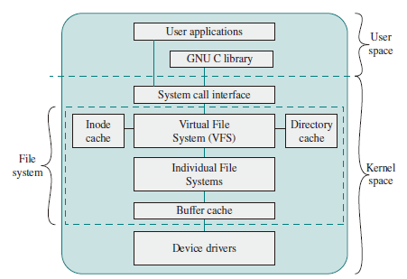
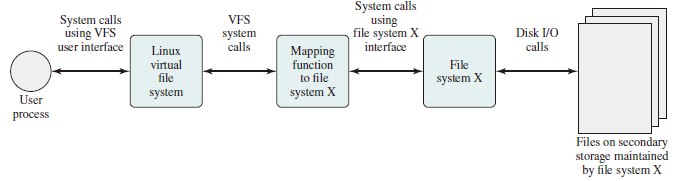

# File System

## Files and File Systems

From the user’s point of view, one of the most important parts of an operating system is the file system. The file system permits users to create data collections, called files, with desirable properties, such as:

* Long-term existence: Files are stored on disk or other secondary storage and do not disappear when a user logs off.
* Sharable between processes: Files have names and can have associated access permissions that permit controlled sharing.

* Structure: Depending on the file system, a file can have an internal structure that is convenient for particular applications. In addition, files can be organized into a hierarchical or more complex structure to reflect the relationships among files.

Any file system provides not only a means to store data organized as files, but a collection of functions that can be performed on files. Typical operations include the following:

* Create
* Delete
* Open
* Close
* Read
* Write

## File Structure

Four terms are in common use when discussing files:

### Field

A **field** is the basic element of data. Depending on the file design, fields may be fixed length or variable length. In the latter case, the field often consists of fwo or three subfields: the actual value to be stored, the name of the fields, and in some cases, the length of the field. In other cases of variable-length fields, the length of the field is indicated by the use of special demarcation (boundary) symbols between fields.

### Record

A **record** is a collection of related fields that can be treated as a unit by some application program. A record will
be of variable length if some of its fields are of variable length or if the number of fields may vary. In the latter case, each field is usually accompanied by a field name. In either case, the entire record usually includes a length field.

### File

A **file** is a collection of similar records. The file is treated as a single entity by users and applications and may be referenced by name. Files have file names and may be created and deleted.

### Database

A **database** is a collection of related data. The essential aspects of a database are that the relationships that exist among elements of data are explicit.

## File Management Systems

A file management system is that set of system software that provides services to users and applications in the use of files. Typically, the only way a user or application may access files is through the file management system.  
The following objectives for a file management system are as follows:

* To meet the data management needs and requirements of the user, which include storage of data and the ability to perform the aforementioned operations
* To guarantee, to the extend possible, that the data in the file are valid
* To optimize performance, both from the system point of view in terms of overall throughput, and from the user’s point of view in terms of response time
* To provide I/O support for a variety of storage device types
* To minimize or eliminate the potential for lost or destroyed data
* To provide a standardized set of I/O interface routines to user processes
* To provide I/O support for multiple users, in the case of multiple-user systems

With respect to the first point, meeting user requirements, the extent of such requirements depends on the variety of applications and the environment in which the computer system will be used. For an interactive, general-purpose system, the following constitute a minimal set of requirements:

1. Each user should be able to create, delete, read, write, and modify files.
2. Each user may have controlled access to other users’ files.
3. Each user may control what types of accesses are allowed to the user’s files
4. Each user should be able to move data between files.
5. Each user should be able to back up and recover the user’s files in case of damage.
6. Each user should be able to access his or her files by name rather than by numeric identifier.

### File System Architecture

### File Management Functions

## File Organization and Access

In choosing a file organization, several criteria are important:

* Short access time
* Ease of update
* Economy of storage
* Simple maintenance
* Reliability

### Five Fundamental Organizations

1. The pile
2. The sequential file
3. The indexed sequential file
4. The indexed file
5. The direct, or hashed, file

## File Directories

### Contents

Associated with any file management system and collection of files is a file directory. The directory contains information about the files, including attributes, location,
and ownership. Much of this information, especially that concerned with storage, is managed by the operating system. The directory is itself a file, accessible by various
file management routines. Although some of the information in directories is available to users and applications, this is generally provided indirectly by system routines.

### Structure

To understand the requirements for a file structure, it is helpful to consider the types of operations that may be performed on the directory:

* Search: When a user or application references a file, the directory must be searched to find the entry corresponding to that file.
* Create file: When a new file is created, an entry must be added to the directory.
* Delete file: When a file is deleted, an entry must be removed from the directory.
* List directory: All or a portion of the directory may be requested. Generally, this request is made by a user and results in a listing of all files owned by that user, plus some of the attributes of each file (e.g., type, access control information,
usage information).
* Update directory: Because some file attributes are stored in the directory, a change in one of these attributes requires a change in the corresponding directory entry.

### Naming

Users need to be able to refer to a file by a symbolic name. Clearly, each file in the system must have a unique name in order that file references be unambiguous. On the other hand, it is an unacceptable burden on users to require they provide unique names, especially in a shared system.  

The use of a tree-structured directory minimizes the difficulty in assigning unique names. Any file in the system can be located by following a path from the root or master directory down various branches until the file is reached. The series of directory names, culminating in the file name itself, constitutes a pathname for the file.

## File Sharing

In a multi-user system, there is almost always a requirement for allowing files to be shared among a number of users. Two issues arise: access rights and the management of simultaneous access.

### Access Rights

The following list is representative of access rights that can be assigned to a particular user for a particular file:

* None: The user may not even learn of the existence of the file, much less access it. To enforce this restriction, the user would not be allowed to read the user directory that includes this file.
* Knowledge: The user can determine that the file exists and who its owner is. The user is then able to petition the owner for additional access rights.
* Execution: The user can load and execute a program but cannot copy it. Proprietary programs are often made accessible with this restriction.
* Reading: The user can read the file for any purpose, including copying and execution. Some systems are able to enforce a distinction between viewing and copying. In the former case, the contents of the file can be displayed to the user, but the user has no means for making a copy.
* Appending: The user can add data to the file, often only at the end, but cannot modify or delete any of the file’s contents. This right is useful in collecting data from a number of sources.
* Updating: The user can modify, delete, and add to the file’s data. This normally includes writing the file initially, rewriting it completely or in part, and removing all or a portion of the data. Some systems distinguish among different degrees of updating.
* Changing protection: The user can change the access rights granted to other users. Typically, this right is held only by the owner of the file. In some systems, the owner can extend this right to others. To prevent abuse of this mechanism, the file owner will typically be able to specify which rights can be changed by the holder of this right.
* Deletion: The user can delete the file from the file system.

One user is designated as the owner of a given file, usually the person who initially created the file. The owner has all of the access rights listed previously and may grant rights to others. Access can be provided to different classes of users:

* Specific user: Individual users who are designated by user ID
* User groups: A set of users who are not individually defined. The system must have some way of keeping track of the membership of user groups.
* All: All users who have access to this system. These are public files.

### Simultaneous Access

When access is granted to append or update a file to more than one user, the operating system or file management system must enforce discipline. A brute-force approach is to allow a user to lock the entire file when it is to be updated. A finer grain of control is to lock individual records during update. Essentially, this is the readers/writers problem. Issues of mutual exclusion and deadlock must be addressed in designing the shared access capability.

## Record Blocking

Given the size of a block, there are three methods of blocking that can be used:

1. Fixed blocking: Fixed-length records are used, and an integral number of records are stored in a block. There may be unused space at the end of each block. This is referred to as internal fragmentation.
2. Variable-length spanned blocking: Variable-length records are used and are packed into blocks with no unused space. Thus, some records must span two blocks, with the continuation indicated by a pointer to the successor block.
3. Variable-length unspanned blocking: Variable-length records are used, but panning is not employed. There is wasted space in most blocks because of the inability to use the remainder of a block if the next record is larger than the remaining unused space.
Fixed blocking is the common mode for sequential files with fixed-length records. Variable-length spanned blocking is efficient of storage and does not limit the size of records. However, this technique is difficult to implement. Records that span two blocks require two I/O operations, and files are difficult to update, regardless of the organization. Variable-length unspanned blocking results in wasted space and limits record size to the size of a block. The record-blocking technique may interact with the virtual memory hardware, if such is employed. In a virtual memory environment, it is desirable to make the page the basic unit of transfer. Pages are generally quite small, so it is impractical to treat a page as a block for unspanned blocking. Accordingly, some systems combine multiple
pages to create a larger block for file I/O purposes. This approach is used for VSAM files on IBM mainframes.

## Secondary Storage Management

On secondary storage, a file consists of a collection of blocks. The operating system or file management system is responsible for allocating blocks to files. This raises two management issues. First, space on secondary storage must be allocated to files, and second, it is necessary to keep track of the space available for allocation. We will see that these two tasks are related; that is, the approach taken for file allocation may influence the approach taken for free space management. Further, we will see that there is an interaction between file structure and allocation policy.

### File Allocation

### Volumes

> Volume: A collection of addressable sectors in secondary memory that an OS or
application can use for data storage. The sectors in a volume need not be consecutive
on a physical storage  device; instead, they need only appear that way to the
OS or application. A volume may be the result of assembling and merging smaller
volumes.

### Reliability

Consider the following scenario:

1. User A requests a file allocation to add to an existing file.
2. The request is granted and the disk and file allocation tables are updated in main memory but not yet on disk.
3. The system crashes and subsequently restarts.
4. User B requests a file allocation and is allocated space on disk that overlaps the last allocation to user A.
5. User A accesses the overlapped portion via a reference that is stored inside A’s file.

This difficulty arose because the system maintained a copy of the disk allocation table and file allocation table in main memory for efficiency. To prevent this type of error, the following steps could be performed when a file allocation is requested:

1. Lock the disk allocation table on disk. This prevents another user from causing alterations to the table until this allocation is completed.
2. Search the disk allocation table for available space. This assumes a copy of the disk allocation table is always kept in main memory. If not, it must first be read in.
3. Allocate space, update the disk allocation table, and update the disk. Updating the disk involves writing the disk allocation table back onto disk. For chained disk allocation, it also involves updating some pointers on disk.
4. Update the file allocation table and update the disk.
5. Unlock the disk allocation table.

## Unix File Management

In the UNIX file system, six types of files are distinguish:

1. Regular, or ordinary: Contains arbitrary data in zero or more data blocks. Regular files contain information entered in them by a user, an application program, or a system utility program. The file system does not impose any internal structure to a regular file, but treats it as stream of bytes.
2. Directory: Contains a list of file names plus pointers to associated **inodes** (index nodes), described later. Directories are hierarchically organized. Directory files are actually ordinary files with special write protection privileges on only the file system can write into them, while read access is available to user programs.
3. Special: Contains no data but provides a mechanism to map physical devices to file names. The file names are used to access peripheral devices, such as terminals and printers. Each I/O device is associated with a special file.
4. Named pipes: A pipe is an interprocess communications facility. A pipe file buffers data received in its input so a process that reads from the pipe's output receives the data on a first-in-first-out basis.
5. Links: In essence, a link is an alternative file name for an existing file.
6. Symbolic Links: This is a data file that contains the name of the file to which it is linked.

### Inodes

Modern UNIX operating systems support multiple file systems but map all of these into a uniform underlying system for supporting file systems and allocating disk space to files. All types of UNIX files are administered by the OS by means of inodes. An inode is a control structure that contains the key information needed by the operating system for a particular file. Several file names may be associated with a single inode, but an active inode is associated with exactly one file, and each file is controlled by exactly on inode.  
The FreeBSD inode structure includes the following data elements:

* The type and access mode of the file
* The file's owner and group-access identifiers
* The time when the file was created, when it was most recently read and written, and when its inode was most recently updated by the system
* The size of the file by bytes
* A sequence of block pointers, explained in the next subsection
* The number of physical blocks used by the file, including blocks used to hold indirect pointers and attributes
* The number of directory entries that reference the file
* The kernel and user-settable flags that describe the characteristics of the file
* The generation number of teh file (a random selected number assigned to the inode each time that the latter is allocated to a new file ; the generation number is use dto detect references to delete files)
* The blocksize of the data blocks references by the inode (typically the same as, but sometimes larger than, the file system blocksize)
* The size of the extended attribute information
* Zero or more extended attribute entries

### File Allocation

File allocation is done on a block basis. Allocation is dynamic, as needed, rather than using preallocation. Hence the blocks of a file on disk are not necessarily contiguous. An indexed method is used to keep track of each file, with part of the index stored in the inode for the file. In all UNIX implementations, the inode includes a number of direct pointers and three indirect pointers (single, double, triple).  

### Directories

Directories are structured in a hierarchical tree. Each directory can contains file and/or other directories. A directory inside another directory is referred to as a subdirectory. As was mentioned, a directory is simply a file that contains a list of file names plus pointers to associated inodes. Each directory entry (dentry) contains a name for the associated file or subdirectory plus an integer called the i-number (index number). When the file or directory is accessed, its i-number is used as an index into the inode table.

### Volume Structure

A UNIX file system resides on a single logical disk or disk partition and is laid out with the following elements:

* Boot block: Contains code required to boot the operating system
* Superblock: Contains attributes and information about the file system, such as partition size, and inode table size
* Inode table: The collection of inodes for each file
* Data block: Storage space available for data files and subdirectories

## Linux Virtual File System

Linux includes a versatile and powerful file-handling facility, designed to support a wide variety of file management systems and file structures. The approach taken in Linux is to make use of a **virtual file system (VFS)**, which presents a single, uniform file system interface to user processes. The VFS defines a common file model that is capable of representing any conceivable file system’s general feature and behavior.  

VFS is an object-oriented scheme. Because it is written in C, rather than a language that supports object programming (such as C++ or Java), VFS objects are implemented simply as C data structures. Each object contains both data and pointers
to file-system-implemented functions that operate on data. The four primary object types in VFS are as follows:

* Superblock object: Represents a specific mounted file system
* Inode object: Represents a specific file
* Dentry object: Represents a specific directory entry
* File object: Represents an open file associated with a process

### The Superblock Object

The superblock object stores information describing file system. Typically, the superblock corresponds to the file system superblock or file system control block, which is stored in a special sector on disk.  
The superblock object consists of a number of data items. Examples include the following:

* The device this file system is mounted on
* The basic block size of the file system
* Dirty flag, to indicate that the superblock has been changed but not written back to disk
* File system type
* Flags, such as a read-only flag
* Pointer to the root of the file system directory
* List of open files
* Semaphore for controlling access to the file system
* List of superblock operations

### The Inode Object

An inode is associated with each file. The inode object holds all the information about a named file except its name and the actual data contents of the file. Items contained in an inode object include owner, group, permissions, access times for a file, size of data it holds, and number of links.  
The inode object also includes an inode operations object that describes the file system’s implemented functions that the VFS can invoke on an inode. The methods defined for the inode object include the following:

* create: Creates a new inode for a regular file associated with a dentry object in some directory
* lookup: Searches a directory for an inode corresponding to a file name
* mkdir: Creates a new inode for a directory associated with a dentry object in some directory

### The Dentry Object

A dentry (directory entry) is a specific component in a path. The component may be either a directory or a file name. Dentry objects facilitate quick lookups to files and directories, and are used in a dentry cache for that purpose. The dentry object includes a pointer to the inode and superblock. It also includes a pointer to the parent dentry and pointers to any subordinate dentrys.

### The File Object

The file object is used to represent a file opened by a process. The object is created in response to the `open()` system call, and destroyed in response to the `close()` system call. The file object consists of a numbers of items, including the following:

* Dentry object associated with the file
* File system containing the file
* File objects usage counter
* User's user ID
* User's group ID
* File pointer, which is the current position in the file from which the current position in the file from which the next operation will take place

The file object also includes an inode operations object that describes the file system's implemented functions that the VFS can invoke on a file object. The methods defined for the file object include read, write, open, release, and lock.

### Caches

The VFS employs three caches to improve performance:

1. Inode cache: Because every file and directory is represented by a VFS inode, a directory listing command or a file access command causes a number of inodes to be accessed. The inode cache stores recently visited inodes to make access quicker.
2. Directory cache: The directory cache stores the mapping between the full directory names and their inode numbers. This speeds up the process of listing a directory.
3. Buffer cache: The buffer cache is independent of the file systems and it integrated into the mechanisms that the Linux kernel uses to allocate and read and write data buffers. As the real life systems read data from the underlying physical disks, this results in requests to the block device drivers to read physical blocks from the device that they control. So, if the same data is needed often, it will be retrieved from the buffer cache rather than read from the disk.
