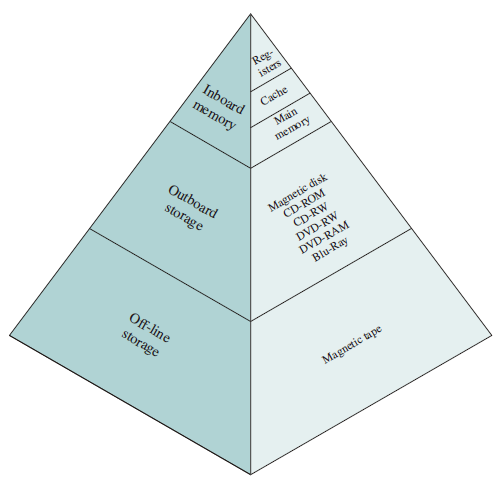
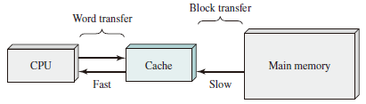
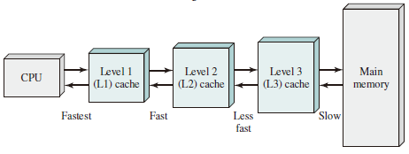
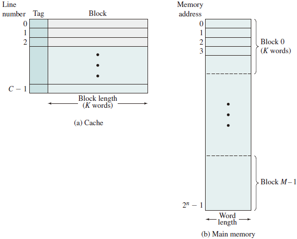
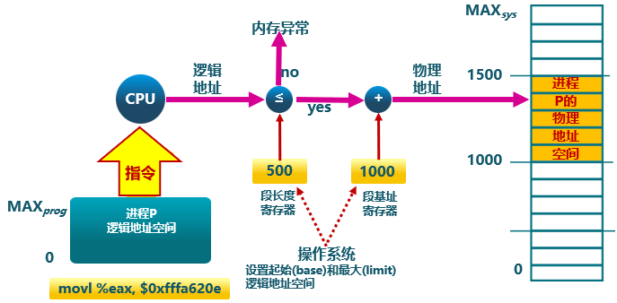
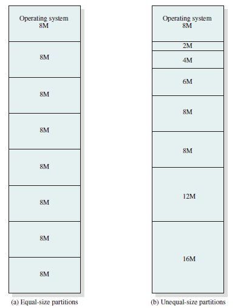
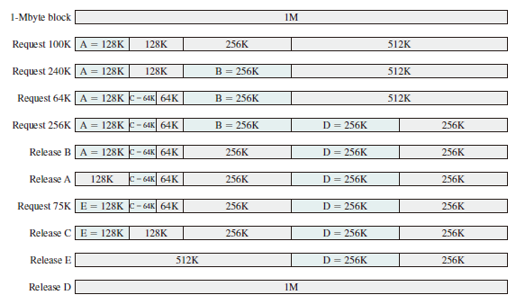

# Memory Management

## The Memory Hierarchy

A typical hierarchy is illustrated in figure below.

As one goes down the hierarchy, the following occur:

* Decreasing cost per bit
* Increasing capacity
* Increasing access time
* Decreasing frequency of access to the memory by the processor

## Cache Memory

Although cache memory is invisible to the OS, it interacts with other memory management hardware.

## Cache Principles

Cache memory is intended to provide memory access time approaching that of the fastest memories available, and at the same time support a large memory size that has the price of less expensive types of semiconductor memories. The concept is illustrated in the Figure below

There is a relatively large and slow main memory together with a smaller, faster cache memory.

The next Figure depicts the use of multiple levels of cache.

Main memory consists of up to $2^n$ addressable words, with each word having a unique $n$-bit address. For mapping purposes, this memory is considered to consist of a number of fixed length **blocks**
of K words each. That is there are $M=2^n/K$ blocks. Cache consists of C **slots** (*lines*) of K words each, and the number of slots is considerably less than the number of main memory blocks ($C << M$).

## Memory Management Methods

* Relocation
* Segmentatio   n
* Paging
* Virtual Memory

## Address Space

The range of addresses available to a computer program.

* A logical address is a reference to a memory location **independent** of the current assignment of data to memory; a translation must be made to a physical address before the memory access can be achieved.

* A relative address is a particular
example of logical address, in which the address is expressed as a location relative to some known point, usually a value in a processor register.

* A physical address, or absolute address is an **actual** location in main memory.

### Generating Logical Address

* Compile
* Assemble
* Link
* Relocation

### Procedures

* CPU
  * ALU: 需要逻辑地址的内存内容
  * MMU：进行逻辑地址和物理地址的转换
  * CPU 控制逻辑：给总线发送物理地址请求
* 内存： 发送物理地址的内容给 CPU 或接受 CPU 数据到物理地址
* 操作系统：建立逻辑地址与物理地址的映射

### Address Check

## Memory Partitioning

The principal operation of memory management is to bring processes into main memory for execution by the processor.

### Fixed Partitioning

In most schemes for memory management, we can assume the OS occupies some fixed portion of main memory, and the rest of main memory is available for use by multiple processes. The simplest scheme for managing this available memory is to partition it into regions with fixed boundaries.

#### Description

Main memory is divided into a number of static partitions *at system generation time*. A process may be loaded into a partition of *equal or greater size*.

#### Strengths

Simple to implement; little operating system overhead.

#### Weaknesses

Inefficient use of memory due to internal fragmentation; maximum number of active processes is fixed.

With unequal-size partitions, there are two possible ways to assign processes to partitions. The simplest way is to assign each process to the smallest partition within which it will fit. In this case, a scheduling queue is needed for each partition to hold swapped-out processes destined for that partition

### Internal Fragmentation

Occurs when memory is divided into fixed-size partitions (e.g., page frames in main memory, physical blocks on disk). If a block of data is assigned to one or more partitions, then there may be wasted space in the last partition. This will occur if the last portion of data is smaller than the last partition.

### External Fragmentation

Occurs when memory is divided into variable-size partitions corresponding to the blocks of data assigned to the memory (e.g., segments in main memory). As segments are moved into and out of the memory, gaps will occur between the occupied portions of memory.

### Dynamic Partitioning

#### Description

Partitions are created dynamically, so each process is loaded into a partition of exactly the same size as that process. Data structure is used in dynamic partitioning to maintain allocated blocks and empty blocks.

#### Strengths

No internal fragmentation; more efficient use of main memory.

#### Weaknesses

Inefficient use of processor due to the need for compaction to counter external fragmentation.

#### Placement Algorithms

Three placement algorithms that might be considered are **best-fit, first-fit, and next-fit**. All, of course, are limited to choosing among free blocks of main memory that are equal to or larger than the process to be brought in. **Best-fit** chooses the block that is closest in size to the request. **First-fit** begins to scan memory from the beginning and chooses the first available block that is large enough. **Next-fit** begins to scan memory from the location of the last placement and chooses the next available block that is large enough.

* Best-fit: 分配 n 字节的分区时，查找并使用不小于 n 的最小空闲分区
  * 原理及实现
    * 空闲分区列表按大小排序
    * 分配时查找一个合适的分区
    * 释放时查找并合并邻近的空闲分区
  * 优点
    * 大部分分配块的尺寸较小时效果较好
    * 可避免大的空闲分区被拆分
    * 可减小外部碎片的大小
    * 实现简单
  * 缺点
    * 容易产生外部碎片
    * 释放分区速度较慢

* Worst-fit: 分配 n 字节，使用尺寸不小于 n 的最大空闲分区
  * 原理及实现
    * 空闲分区列表按由大到小排序
    * 分配时，选最大的分区
    * 释放时，尽可能与邻近分区合并，并调整空闲分区列表顺序
  * 优点
    * 中等大小的分配请求较多时，效果最好
    * 不会出现太多的小碎片

  * 缺点
    * 释放分区速度较慢
    * 容易产生外部碎片
    * 容易破坏大的空闲分区

* First-fit: 分配 n 个字节，使用第一个可用的空间比 n 大的空闲块。
  * 原理及实现
    * 空闲分区列表按地址顺序排序
    * 分配时，选第一个合适的分区
    * 释放时，尽可能与邻近分区合并
  * 优点
    * 实现简单
    * 在高地址空间有大块的空闲分区  
  * 缺点
    * 分配大块空间速度较慢
    * 容易产生外部碎片

### Defragmentation

通过调整进程占用的分区位置来减少或避免分区碎片。

#### Compaction

通过移动分配给进程的内存分区，以合并外部碎片。  
碎片紧凑的条件：所有的应用程序可动态重定位。

#### Swapping in/out

通过抢占并回收处于等待状态进程的分区，以增大可用内存空间

## Buddy System

Both fixed and dynamic partitioning schemes have drawbacks. A fixed partitioning scheme limits the number of active processes and may use space inefficiently if there is a poor match between available partition sizes and process sizes. A dynamic partitioning scheme is more complex to maintain and includes the overhead of compaction. An interesting compromise is the buddy system.
In a buddy system, memory blocks are available of size $2^K$ words, $L \leq K \leq U$, where  

* $2^L =$ small size block that allocated

* $2^U =$ largest size block that is allocated; generally $2^U$ is the size of the entire memory available for allocation

To begin, the entire space available for allocation is treated as a single block of size $2^U$. If a request of size $s$ such that $2^{U-1} <s \leq 2^U$ is made, then the entire block is allocated. Otherwise, the block is split into two equal buddies of size $2^{U-1}$. This process continues until the smallest block greater than or equal to $s$ is generated and allocated to the request. At any time, the buddy system maintains a list of holes (unallocated blocks) of each size $2^i$. A hole may be removed from the $(i + 1)$ list by splitting it in half to create two buddies of size $2^i$ in the $i$ list. Whenever a pair of buddies on the $i$ list both become unallocated,they are removed from that list and coalesced into a single block on the $(i + 1)$ list. Presented with a request for an allocation of size $k$ such that $2^{i-1} < k \leq 2^i$.  
The Figure below gives an example using a 1-Mbyte initial block.

