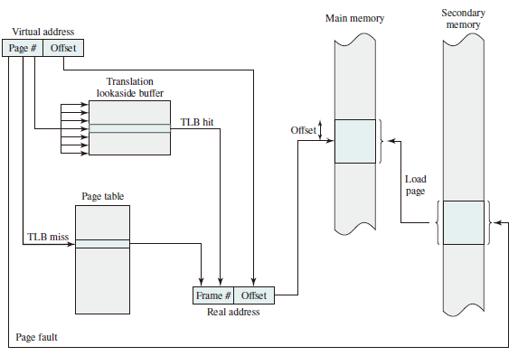
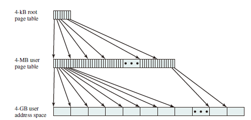
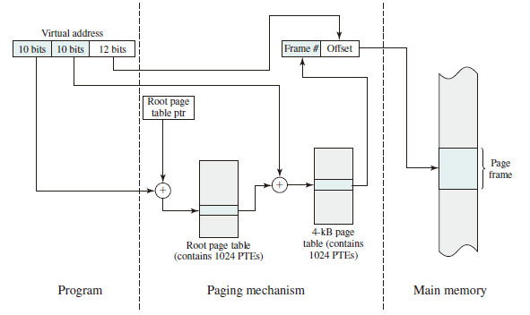

# Non-contiguous Memory Allocation

* 设计目标：提高内存利用效率和管理灵活性
* 优点
  * 允许一个程序的使用非连续的物理地址空间
  * 允许共享代码与数据
  * 支持动态加载和动态链接

## Segmentation

### Segmented Address Space

进程的段地址空间由多个段组成：主代码段、子模块代码段、公用库代码段、堆栈段（stack）、堆数据（heap）、初始化数据段和符号表等。  
段式存储管理的目的在于**更细粒度和灵活的分离与共享**。  

### Access Mechanisms

* 段的概念

  * 段表示访问方式和储存数据等属性相同的一段地址空间。
  * 对应一个连续的内存块
  * 若干个段组成逻辑地址空间
* 段访问： 逻辑地址由段基址+段内偏移组成的二元组$(\mathrm{s}, \mathrm{addr})$构成

## Paging

* Frame: 把物理地址空间划分为大小相同的基本分配单位（2 的 $n$ 次方）
* Page: 把逻辑地址空间也划分为相同大小的基本分配单位
* Frame 和 Page 的大小必须是相同的

### Frame

物理内存被划分为相同大小的帧，用二元组 $(f, o)$ 表示，其中 $f$ 代表帧号（共有 $2^f$ 个帧），每个帧有 $2^s$ 个字节。因此物理地址计算公式为 $f \times 2^s+o$

### Page

进程逻辑地址空间被划分为大小相等的页，通常来讲，页内偏移等于段内偏移但页号不等于帧号。逻辑地址由二元组 $(p, o)$ 表示，虚拟地址计算公式为 $p \times 2^s + o$

### Address Mapping

* 逻辑地址中的页号是连续的
* 物理地址中的帧号不是连续的
* **不是**所有的页都有相应的帧对应

### Page Tables

Page tables save the information of the mapping from logical addresses to physical addresses.  

每一个进程都有一个页表，每一个页面对应一个页表项，通过 Page Table Base Register (PTBR) 实现页面到页表项之间的映射。

* 页表项的构成
  * 帧号：f
  * 页表项标志
    * 存在位
    * 修改位
    * 引用位

### Performance Problem

1. 访问一个内存单元需要先访问页表，再访问数据。
2. 页表可能会非常大  
  
How to solve: Caching or Indirection

## Translation Lookaside Buffer

Translation lookaside buffer (TLB) functions in
the same way as a memory cache and contains those page table
entries that have been most recently used. The organization of the resulting paging
hardware is illustrated in Figure below. Given a virtual address, the processor will first examine the TLB. If the desired page table entry is present (TLB hit), then the frame number is retrieved and the real address is formed. If the desired page table entry is
not found (TLB miss), then the processor uses the page number to index the process page table and examine the corresponding page table entry. If the “present bit” is set, then the page is in main memory, and the processor can retrieve the frame number
from the page table entry to form the real address. The processor also updates the
TLB to include this new page table entry. Finally, if the present bit is not set, then the desired page is not in main memory and a memory access fault, called a page fault, is issued.  

### Hierarchical Page Table

Take a two-level hierarchical page table as an example:

  

