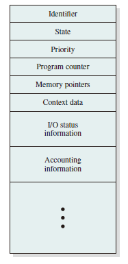
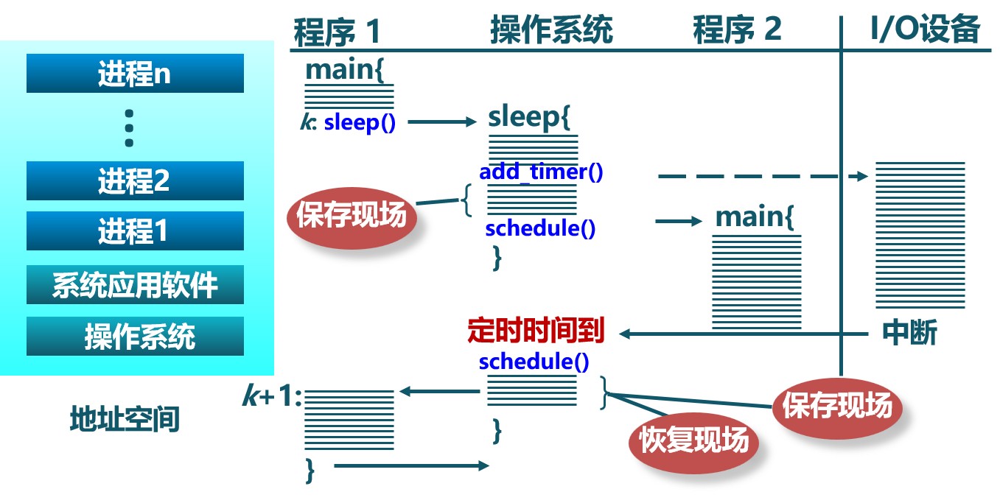
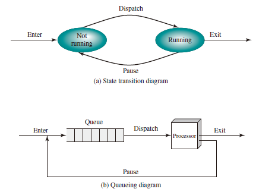
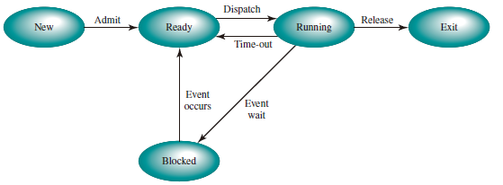
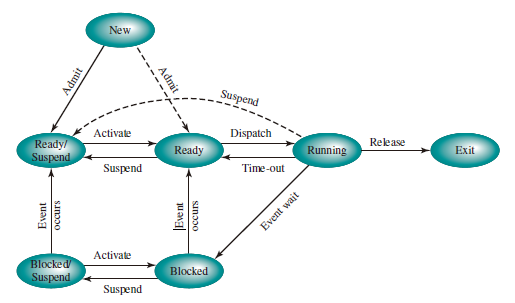
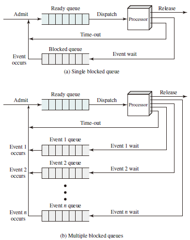
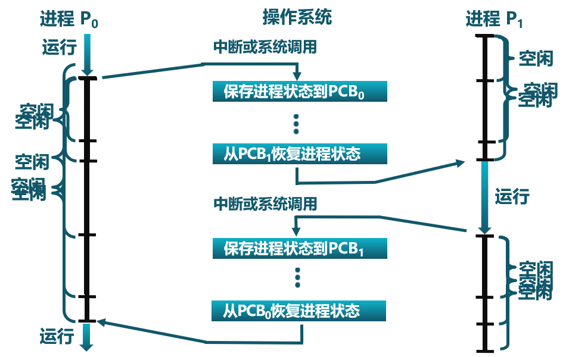
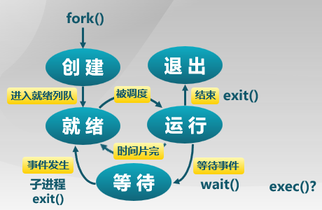

# Processes

## Definition

进程是指一个具有一定独立功能的程序在一个数据集合上的一次动态执行过程。

## Composition

* 代码
* 数据
* 状态寄存器：CR0, IP
* 通用寄存器：AX, BX, CX
* 进程占用系统资源

### Features

* 动态性：可动态地创建、结束进程
* 并发性：进程可以被独立调度并占用处理机运行
* 独立性：不同进程的工作不相互影响
* 制约性：因访问共享数据/资源或进程间同步而产生制约

### Relations and Discrepancies between programs

#### Relations

* Processes are the abstract of Programs in executive states  
  * Program = Static executive file  
  * Process = Program + executive states  
* Multiple executions of the some program are regarded as different processes.
* Necessary resources in executing processes: Memory and CPU

#### Discrepancies

* 进程时动态的，程序时静态的
  * 程序是有序代码的集合
  * 进程是程序的执行
* 进程是暂时的，程序时永久的
  * 进程是一个状态变化的过程
  * 程序可长久保存
* 进程与程序的组成不同：进程的组成包括程序、数据和进程控制块

## Process Control Block

操作系统用 PCB 来进程的基本状态，每个进程都在操作系统中有一个唯一对应的PCB

### Structure

At any given point in time, while the program is executing, this process can be uniquely characterized by a number of elements, including the following:

* Identifier: A unique identifier associated with this process, to distinguish it from all other processes.
* State: If the process is currently executing, it is in the running state.
* Priority: Priority level relative to other processes.
* Program counter: The address of the *next instruction* in the program to be executed.
* Memory pointers: Include pointers to the program code and data associated
with this process, plus any memory blocks shared with other processes.
* Context data: These are data that are present in registers in the processor while the process is executing.
* I/O status information: Includes outstanding I/O requests, I/O devices assigned to this process, a list of files in use by the process, and so on.
* Accounting information: May include the amount of processor time and clock time used, time limits, account numbers, and so on.

### Control Information

* 调度和状态信息： 调度进程和处理及使用情况

* 进程间通信信息： 进程间通信相关的各种标识

* 储存管理信息

* 进程所用资源

* 有关数据结构的连接信息

### Implementation

* 链表：同一状态进程的 PCB 组成链表
* 索引表：统一状态进程的 PCB 被同一索引指向

## Process States

### Life-cycle

* 进程创建
  * 系统初始化时
  * 用户请求创建一个新进程
  * 被其他进程调用
* 进程执行
  * 内核选择一个就绪进程，让其占用处理机并执行
* 进程等待
  * 请求并等待系统服务，无法马上完成
  * 启动某种无法马上完成的操作
  * 需要的资源没有达到
* 进程抢占
  * 被高优先级进程抢占
  * 在规定时间内未完成
* 进程唤醒
  * 被阻塞进程需要的资源可被满足
  * 被阻塞进程等待的时间到达
  * 被阻塞的进程只能被别的进程或操作系统唤醒
* 进程结束
  * 自愿结束
    * 正常退出
    * 错误退出
  * 非自愿结束
    * 致命错误
    * 被其他进程所杀

操作系统在 **中断** 中处理进程  
以 *Sleep()* 为例，创建 -> 就绪 -> 运行 -> 等待 -> 操作系统时钟中断 ...

### Process Creation  

### Processes Switching

### Processes Termination

### A Two-State Process Model

### A Five-State Model

Split the Not Running state of the two-state process model into two states: Ready and Blocked and add two additional states for good measure, we can get a five-state model as follows:

1. Running: The process that is currently being executed.
2. Ready: A process that is prepared to execute when given the opportunity.
3. Blocked/Waiting: A process that cannot execute until some event occurs, such as the completion of an I/O operation.
4. New: A process that has just been created but has not yet been admitted to the pool of executable processes by the OS. Typically, a new process has not yet been loaded into main memory, although its process control block has been created.
5. Exit: A process that has been released from the pool of executable processes by the OS, either because it halted or because it aborted for some reason.

Figure above indicates the types of events that lead to each state transition for a process; the possible transitions are as follows:

* Null -> New: A new process is created to execute a program.
* New -> Ready: The OS will move a process from the New state to the **Ready state** when it is prepared to take on an additional process.
* Ready -> Running: When it is time to select a process to run, the OS chooses one of the processes in the Ready state.
* Running -> Exit: The currently running process is terminated by the OS if the process indicates that it has completed or if it aborts.
* Running -> Ready
  * The running process has reached the maximum allowable time for uninterrupted execution;
  * The OS preempted a process if there is another process with higher priority level being blocked.
* Running -> Blocked: A process is put in the **Blocked state** if it requests something for which it must wait. For example, a process may request a service from OS that OS is not prepared to perform immediately or a process may initiate that must be completed before the process can continue.
* Blocked -> Ready: A process in the Blocked state is moved to the Ready state when the event for which it has been waiting occurs.
* Ready -> Exit: For clarity, this transition is not shown on the state diagram. In some systems, a parent may terminate a child process at any time. Also, if a parent terminates, all child processes associated with that parent may be terminated.
* Blocked -> Exit: The comments under the preceding item apply.

## Suspended Processes

There are two independent concepts here: whether a process is waiting on an event (blocked or not), and whether a process has been swapped out of main memory (suspended or not). To accommodate this $2 \times 2$ combination, we need four states:

1. Ready: The process is in main memory and available for execution.
2. Blocked: The process is in main memory and awaiting an event.
3. Blocked/Suspend: The process is in **secondary memory** and **awaiting** an event.
4. Ready/Suspend: The process is in **secondary memory** but is **available** for execution
as soon as it is loaded into main memory.

Important new transitions are the following:

* Blocked -> Blocked/Suspend:
* Blocked/Suspend -> Ready/Suspend:
* Ready/Suspend -> Ready:
* Ready -> Ready/Suspend:
* Blocked/Suspend -> Blocked:

## Queueing Model

## Process Switching

On the face of it, the function of process switching would seem to be straightforward. At some time, a running process is interrupted, and the OS assigns another process to the Running state and turns control over to that process. However, several design issues are raised.

* First, what events trigger a process switch?
* Another issue is that we must recognize the distinction between mode switching and process switching.
* Finally, what must the OS do to the various data structures under its control to achieve a process switch?

When to Switch Processes:

* Interrupt
  * Clock interrupt
  * I/O interrupt
  * Memory fault
* Trap
* Supervisor call

进程切换的要求：

* 切换前，保存进程上下文
* 切换后，恢复进程上下文
* 快速切换

进程生命周期的信息：

* 寄存器
* CPU 状态
* 内存地址空间

### Example

以进程 P0、进程 P1 为例：  
P0 执行 --> 中断或系统调用 --> P0 保存 --> P1 恢复 --> P1 执行 --> 中断或系统调用 --> P1 保存 --> P0 恢复 --> P0 执行  
图示：

在进程切换的过程中，内核为每一个进程维护了一个对应的进程控制块（PCB），内核将相同状态进程的 PCB 放在同一队列。

### Instructions in Linux

* 创建进程：`fork` or `exec`
* 父进程等待子进程：`wait`
* 进程的有序终止：`exit`
* 优先级控制：`nice`
* 进程调试支持：`ptrace`
* 定时：`sleep`  

