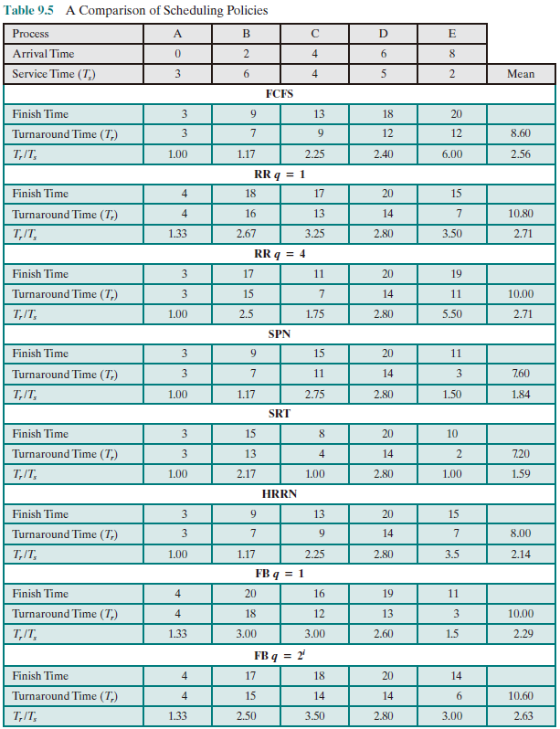
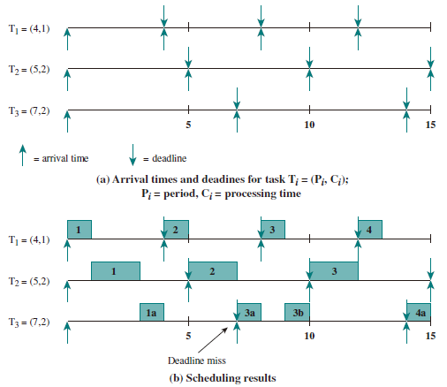

# Scheduling

## Uniprocessor Schduling

In a multiprogramming system, multiple processes exist concurrently in main memory. Each process alternates between using a processor and waiting for some event to occur, such as the completion of an I/O operation. The processor or processors are kept busy by executing one process while the others processes wait.

### Types of Processor Scheduling

* Long-term scheduling: The decision to add to the pool of processes to be executed.
* Medium-term scheduling: The decision to add to the number of processes that are partially or fully in main memory.
* I/O scheduling: The decision as to which process's pending I/O request shall be handled by an available I/O device.

### Time Division Multiplexing

* 进程切换： CPU 资源占用者的切换
  * 保存当前进程在 PCB 的上下文
  * 恢复下一个进程的执行上下文
* 处理机调度：从就绪队列中**挑选**下个占用 CPU 资源的 **进程**，从多个 CPU 中**挑选**就绪进程可用的 CPU **资源**
* 调度程序：挑选就绪进程的内核函数
* 调度形式
  * 非抢占系统：当前进程主动放弃 CPU
  * 可抢占系统：中断请求被服务例程响应完成时或当前进程被抢占
* 调度策略：如何从就绪队列中选择下一个执行进程

### Principles of Scheduling Algorithms

* CPU 使用率：处于忙状态的**时间百分比**
* 吞吐量 (Throughput)：单位时间完成的**进程数量**
* 周转时间 (Turnaround Time)：进程从初始化到结束的**总时间**
* 等待时间 (Waiting Time)：进程在就绪队列的**总时间**
* 响应时间 (Response Time)：从提交请求到产生相应所花费的**总时间**  

调度算法需要得到**更快**的服务，也需要得到**高吞吐量**，而***带宽和延迟不可兼得***。

* 处理机调度策略的相应时间目标
  * 减少响应时间
  * 减少平均响应时间的波动（操作系统的计算延迟）
* 处理机调度策略的吞吐量目标
  * 增加吞吐量：减少开销、系统资源的高效开销
  * 减少等待时间，即减少每个进程的等待时间
  * 操作系统需要保证吞吐量不受用户交互的影响

* 处理机调度的公平性目标
  * *公平不等于公正（例如：富人和穷人缴同等额度的税）*

  * 公平性即保证每个进程占用相同的 CPU 的时间、保证每个进程的等待时间相同
  * 公平通常会增加平均响应时间，降低效率

### Scheduling Criteria

* User Oriented, Performance Related
  * Turnaround time（周转时间）：waiting time plus service time
  * Response time（响应时间）：from the submission of a request until the response begins to be received
  * Deadlines
* User Oriented, Other
  * Predictability
* System Oriented, Performance Related
  * Throughput
  * Processor utilization
* System Oriented, Other
  * Fairness
  * Enforcing priorities
  * Balancing resources

### Scheduling Algorithms

Table below presents some summary information about the various scheduling policies that are examined in this subsection. **The selection function determines which process, among ready processes, is selected next for execution**. The function may be based on priority, resource requirements, or the execution characteristics of the process. In the latter case, three quantities are significant:  

$w = $ time spent in system so far, **waiting**
$e = $ time spent in **execution** ***so far***
$s = $ total **service** time required ***by the process***

The decision mode specifies the instants in time at which the selection function is exercised. There are two general categories:

* Nonpreemptive: Once a process is in the Running state, it continues to execute until it terminates or it blocks itself to wait for I/O or to request some OS service.

* Preemptive: The current running process may be interrupted and move to the Ready state by the OS, which happens when a new process arrives, when an interrupt occurs that places a blocked process in the Ready state, or periodically, based on a clock interrupt.

||FCFS|SPN|HRRN|RR|
|:--:|:--:|:--:|:--:|:--:|
|Selection Function|$\max[w]$|$\min[s]$|$\max(\frac{w+s}{s})$|constant|
|Decision Mode|Non-preemptive|Non-preemptive|Non-preemptive|Preemptive|
|Throughput|Not emphasized|High|High|May be low if quantum is too small|
|Response Time|May be high Provides good response time for short processes|Provides good response time for short processes|Provides good response time|Provides good response time for short processes|
|Overhead|Penalizes short processes; penalizes I/O-bound processes|Penalizes long processes|Good balance|Fair treatment|
|Starvation|No|Possible|No|No|

#### First Come First Served, FCFS

先来先服务算法：依据进程进入就绪状态的先后顺序排列（超市结账排队）

* 优点：简单
* 缺点：
  * **平均等待时间波动较大**：短进程可能排在长进程后面；
  * **I/O 和 CPU 资源利用较低**：CPU 密集进程不使用 I/O，I/O 密集进程不使用 CPU
* 示例：3 个进程，计算时间分别为 12, 3, 3
  * 任务到达顺序：P<sub>1</sub>, P<sub>2</sub>, P<sub>3</sub>，周转时间 (Turnaround Time)为$(12+15+18)/3=15$
  * 任务到达顺序：P<sub>2</sub>, P<sub>3</sub>, P<sub>1</sub>，周转时间为$(3+6+18)/3=9$

#### Shortest Process Next, SPN

短进程优先算法：选择就绪队列中**执行时间最短**的进程占用 CPU 进入运行状态

* 就绪队列按预期的执行时间来排序
* 具有最优平均周转时间
* 连续的短进程流会使长进程无法获得 CPU 资源，对长进程不公平
* 需要预估下一个 CPU 计算的持续时间
  * 通过问用户的方式。用户欺骗就杀死进程
  * 基于历史的记录学习（类似于动量梯度下降，即 $t_i = \alpha t_i + (1-\alpha)\tau_{i-1}$）

* How to Estimate Processing Time

  * The simplest calculation of estimating the processing time of each process would be $$ S_{n+1} = \frac{1}{n}\sum \limits_{i=1}^nT_i$$ where $T_i$ is processor execution time for the *i*th instance of process, $S_i$ is predicted value for the *i*th instance
  * To avoid recalculating the entire summation each time, we can get $$ S_{n+1} = \frac{1}{n}T_n+\frac{n-1}{n}S_n$$ Typically,we would like to give greater weight to more recent instances, because these are more likely to reflect future behavior.

  * A common technique for predicting a future value on the basis of a time series of past values is **exponential averaging**:
  
  $$S_{n+1} = \alpha T_n+(1 - \alpha)S_n  $$
  where $\alpha$ is a constant weighting factor ($0 < \alpha < 1$) that determines the relative weight given to more recent observations relative to older observations. To see this more clearly, consider an expansion
  $$
  S_{n+1}=\alpha T_{n}+(1-\alpha) \alpha T_{n-1}+\ldots+(1-\alpha)^{i} \alpha T_{n-i}+\ldots+(1-\alpha)^{n} S_{1}
  $$

#### Highest Response Ratio Next, HRRN

最高响应比优先算法：选择就绪队列中相应比 R 值最高的进程
$$R = (w+s)/s$$

where
$R = $ response ratio
$w = $ time spent waiting for the processor
$s = $ expected service time  

特点：在短进程优先算法的基础上进行改进；不可抢占；关注进程的等待时间；防止无限期推迟

#### Round Robin, RR

时间片轮转算法：A straightforward way to reduce the penalty that **short jobs** suffer with FCFS is to use **preemption** based on a clock.

* 时间片 (slices of time)： 分配处理及资源的基本时间单位
* 算法思路：时间片结束后，按 FCFS (First come, first service) 算法切换到下一个就绪进程；每隔 $n-1$ 个时间片进程执行一个时间片 q。(When the interrupt occurs, the currently running process is placed in the ready queue, and the next ready job is selected on a FCFS basis.)
* 示例：
  * P1: 53, P2: 8, P3: 68, P4: 24 （时间片为20）  
  * P1 0-20，P2 20-28，P3 28-48，P4 48-68（P2 已结束）  
  * P1 68-88，P3 88-108，P4 108-112 （P4 已结束）  
  * P1 112-125，P3 125-145 （P1 已结束）  
  * P3 145-153 （P3已结束）  
  * 等待时间 $\begin{aligned}
            P1 &= (68-20) + (112-88) = 72 \\
            P2 &= (20-0) = 20 \\
            P3 &= (28-0)+(88-48)+(125-108)+(145-145) = 85 \\
            P4 &= (48-0)+(108-68)=88 \\
        \end{aligned}$  
  * 平均等待时间：$(72+20+85+88)/4 = 66.25$  
* 时间片太大：等待时间太长，极端情况会退化成 FCFS
* 时间片太小：产生大量上下文切换且开销太大
* 经验规则：维持上下文切换开销处于 1% 以内

#### Multiple Queues, MQ

* 多级队列调度算法
  * 就绪队列被划分为几个对立的子队列，是上述几种算法的综合
  * 每个队列都有自己的调度策略
  * 队列之间的调度：
    * 固定优先级：先处理前台，再处理后台
    * 时间片轮转：每个队列都能得到一个确定且能够调度其进程的 CPU 总时间

#### Multilevel Feedback Queues, MLFQ

* 多级反馈队列算法
  * 进程可在不同队列间移动的多级队列算法
  * CPU 密集型进程优先级下降得很快
  * 对 I/O 密集型进程有利

#### Fair-Share Scheduling

公平共享调度算法:公平共享调度控制用户对系统资源的访问

* 一些用户组比其他用户组更重要
* 保证不重要的组无法垄断资源
* 未使用的资源按比例分配
* 没有达到资源使用率目标的组获得更高的优先级

#### A Comparison of Scheduling Policies



### Real-time Scheduling

* 定义:正确性依赖于其 **时间** 和 **功能** 两方面的操作系统
* 实时操作系统的性能指标
  * 时间约束的及时性
  * 速度和平均性能相对不重要
* 分类
  * 强实时操作系统
    * 要求在指定时间内必须完成重要的任务
  * 弱实时操作系统
    * 重要进程有高优先级

* Hard Deadline: 错过任务实现会导致灾难性后果;必须验证,在最坏的情况下能够满足实现
* Soft deadline: 通常能满足任务时限，尽力保证满足任务时限；若不能满足则降低要求
* 可调度性: 表示一个实时操作系统能够满足任务时限要求
* 实时调度算法
  * 速率单调调度算法 (Rate Monotonic Scheduling): 通过 **周期** 安排优先级,周期越短优先级越高，执行周期最短的任务
    * 示例：
  * 最早截止时间优先算法 (Earliest Deadline First, EDF): 截止时间越早优先级越高，执行截止时间最早的任务

## Multicore Scheduling

* 多处理器调度
  * 多个处理机组成一个多处理器系统
  * 处理机间可负载共享
  * 对称多处理机的进程分配:
    * 静态进程分配
    * 动态进程分配
  * 优先级反置 (Priority Inversion): 操作系统中出现高优先级进程长时间等待低优先级进程所占用资源的现象
    * 解决方法: 优先级继承 (Priority Inheritance)、优先级天花板协议  (Priority Ceiling Protocol)

### Algorithms

#### SQMS (Single Queue Multiprocessor Schedule)

* Lack of scalability.
* Weak in cache affinity, violates the locality principle.

* Let process run in the same CPU, load balance will be invalid.

* Thus either assure the cache affinity or load balance.

#### MQMS (Multi-Queue Multiprocessor Scheduling)

* Queues assign to different CPUs, and the scheduling algorithms can be different.

* 所有进程都可以保持在一个 CPU 上。
  
* 容易造成负载不均。

> 例如：某一个 CPU 任务执行完毕后，该 CPU 处于空转状态。因此只有通过进程的跨 CPU 迁移才能实现负载均衡。

* 具有可扩展性，队列数可根据 CPU 数进行扩展。

**如何进行进程工作的迁移？**

* Work stealing: 进程、页表基址等需要迁移。

### SMP and Linux Kernel

Linux Kernel 2.4 的 $O(n)$ 调度算法：*initial queue* 和 *expired queue*， 单队列机制。

Linux Kernel 2.6 的 $O(1)$ 调度算法：由 Ingo Molnar 设计，由于 Linux 系统有 140 中优先级，因此用一个 140 维的数组存放。在 active bitarray 中寻找 left-most bit 的位置，并在 APA 中寻找 APA[x]， 从 APA[x] 中 dequeue 一个 process，对于当前执行完的 process，重新计算 priority 再 enqueue 到 expired priority array 相应的队列 EPA[x] 中。在一定时间间隔后，要进行 load balance 分析。

**操作系统内核和驱动程序属于动态链接库。**

#### Completely Fair Scheduler, CFS

通过**计算进程消耗的 CPU 时间**而不是优先级来进行调度。占用的资源越少，优先级就越高，但这种做法不一定公平，因为有些进程相比于其他进程更加重要即使执行的时间很长，因此会对每个进程进行赋权，即维护相对公平性。

分配给进程的运行时间 = 调度周期 × 进程权重/总权重之和。调度周期即指把所有 TASK_RUNNING 态进程都调度一遍的时间。
Linux 引入 vruntime 进行计算：实际运行时间 × 1024/进程权重，vruntime 越小表示以前占用 CPU 时间较短，受到了不公平待遇。
例如：系统中只有两个权重为 1 和 2 的进程，假设跳读周期为 30ms

* A 的 CPU 时间为 $30 \times 1/3 = 10 \mathrm{ms}$
* B 的 CPU 时间为 $30 \times 2/3 = 20 \mathrm{ms}$

则在这 30 ms 中 A 运行 10 ms，B 运行 20 ms。

问题：新进程的 vruntime 为 0，则在相当长时间内都会保持抢占 CPU 的优势，因此应该设定一个最小值从而与老进程保持在一个合理的差距范围内。  

* 休眠进程在唤醒后的 vruntime 相比于其他 active 进程较小，因此会强占 CPU，因此在进程重新唤醒后应该对 vruntime 进行一些补偿。在 Linux 中 sched_features 的 WAKEUP_PREEMPT 位决定在休眠后是否主动强占 CPU。

* 进程从一个 CPU 迁移到另一个 CPU 上时 vruntime 会不会变？
当一个进程从 CPU_x 出去并进入 CPU_y 的运行队列中时，它的 vruntime = vruntime - min_vruntime_x + min_vruntime_y。

* 同时 vrumtime 可能会溢出（因为类型是 `unsigned long`，因此在比较 vruntime 的时候应该先减去 min_vruntime。
  * 例子

  ```c++
  unsigned char a = 251, b = 254;
  b += 5;
  signed char c = a - 250, d = b - 250;
  // b 比 a 大 8

  ```  

### Brain Fuck Scheduler, BFS

一种时间片轮转算法的变种，在多处理机情况的但就绪队列选择，增加了队列互斥访问的开销。
