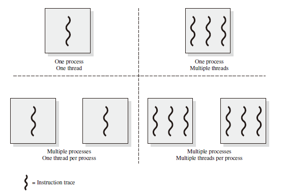
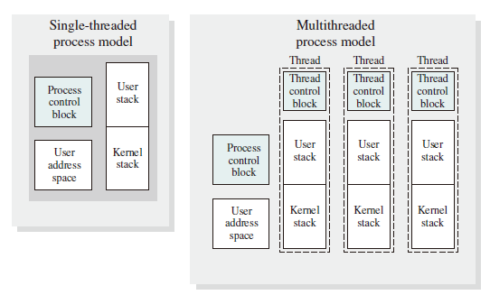
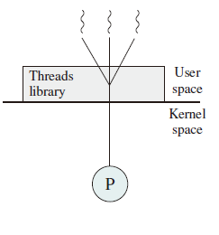
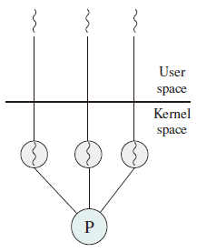
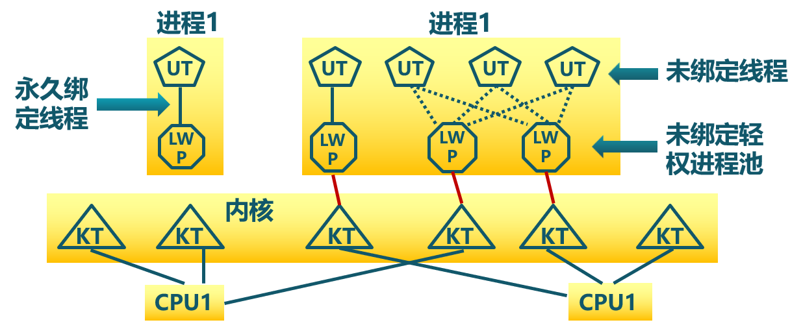

# Threads

## Introduction

多进程的问题：

1. 如何通信、如何共享数据
2. 系统开销较大，涉及进程的创建、进程的终止等

解决思路即在进程内部增加一类实体，满足以下特性：

1. 实体之间可以并发执行
2. 实体之间共享相同的地址空间

## Definition

线程是进程的一部分，描述指令流执行状态，它是进程中**指令执行流**的最小单位，是 **CPU 调度**的基本单位。
线程间的堆栈 (Heap) 资源**不能共享**。  
线程是资源调度的基本单位，即线程描述在进程资源环境中指令流的执行状态。因此同一个进程内的线程共享其资源。

## Multithreading

Multithreading refers to the ability of an OS to support **multiple, concurrent** paths of execution within a single process.

The left half of Figure depicts single-threaded approaches.

* MS-DOS is an example of an OS that supports a single-user process and a single thread.
* Other operating systems, such as some variants of UNIX, support multiple user processes, but only support one thread per process.

The right half part of Figure states two multithreaded approaches.

* A Java runtime environment is an example of a system of one process with multiple threads.
* Windows, Solaris, and many modern versions of UNIX use multiple processes, each of which supports multiple threads.

In a multithreaded environment, a process is defined as the **unit of resource allocation** and **a unit of protection**. The following are associated with processes:

* A virtual address space that holds the process image.
* Protected access to processors, other processors, files, and I/O resources.

With a process, there may be one or more threads, each with following:

* A thread execution state (Running, Ready, etc.)
* A saved thread context when not running; one way to review a thread is as an independent program counter operating within a process
* An execution stack
* Some per-thread static storage for local variables
* Access to the memory and resources of its process, shared with all other threads in that process.  

The Figure below illustrates the distinction between threads and processes from the point of view of process management.

The key benefits of threads derive from the performance implications:

1. It takes **far less time** to create a new thread in an existing process, than to create a brand-new process.

2. It takes **less time** to terminate a thread than a process.

3. It takes **less time** to switch between two thread s within the same process than to switch between processes.

4. Threads **enhance efficiency** in communication between different executing programs.

* 多线程的优点
  * 一个进程中可以同时存在多个线程
  * 多线程之间可以并发
  * 线程间共享地址空间和文件等资源
* 多线程的缺点
  * 一个线程崩溃，会导致同属一个进程下的其他线程崩溃

## Types of Threads

There are two broad categories of thread implementation: **user-level threads (ULTs)**
and **kernel-level threads (KLTs)**. The latter are also referred to in the literature as
kernel-supported threads or **lightweight processes**.

### User-level Threads

由一组用户级的线程库函数来完成线程的管理，包括线程的创建、终止、同步和调度等。

* 优点
  * 不依赖于操作系统
  * 在**用户空间**实现线程机制
    * 每个进程有私有的线程控制块（TCB）列表
    * TCB 列表又线程库函数维护
  * 同一进程内的用户线程切换速度快
  * 允许每个进程拥有自己的线程调度算法

* 不足
  * 线程发起系统调用而阻塞时，整个线程进入等待。
    * 除非当前运行线程主动放弃，否则其所在进程的其他线程无法抢占 CPU
  * 不支持基于线程的*处理机*抢占，除非当前运行线程主动放弃
  * 只能按进程分配 CPU 时间，即在多线程的多进程中，每个线程分配的时间片较少

## Kernel-level Threads

由**内核**通过系统调用实现的线程机制，由**内核**实现线程的创建、终止和管理。

优点：

* 由内核维护 PCB 和 TCB
* 线程执行系统调用而被阻塞不影响其他线程
* 线程的创建、终止和切换相对较大：因为通过系统调用或内核函数，在内核中实现
* 基于线程数量的时间分配：线程数量多的进程 CPU 执行时间多

### Lightweight Process

内核支持的用户线程，一个进程可有一个或多个轻量级进程，每个 Lightweight 进程由一个**单独的内核进程**（即内核线程池）来支持，线程由内核线程池（独立内核进程）执行，但线程与内核线程池之间未绑定。

## Relationship between Threads and Processes

|Threads: Processes| Description| Example Systems|
|:--:|:--:|:--:|
|1:1|Each thread of execution is a unique process with its own address space and resources.|Traditional UNIX implementations|
|M:1|A process defines an address space and dynamic resource ownership. Multiple threads may be created and executed within that process.|Windows NT, Solaris, Linux, OS/2, OS/390, MACH|
|1:M|A thread may migrate from one process environment to another. This allows a thread to be easily moved among distinct systems.|Ra (Clouds), Emerald|
|M:N|It combines attributes of M:1 and 1:M cases.|TRIX|
