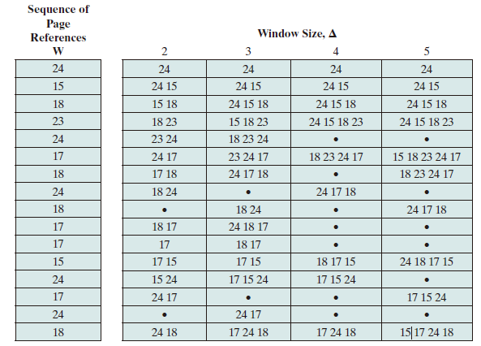
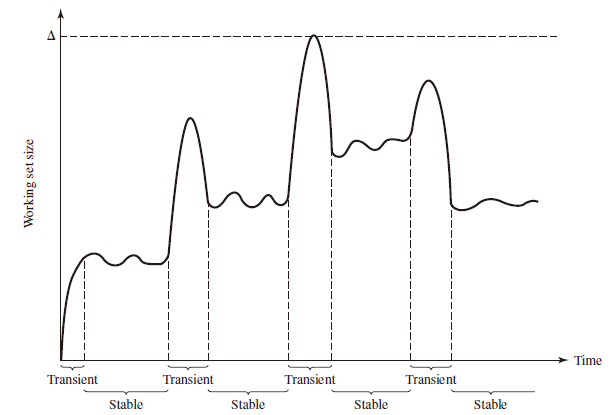
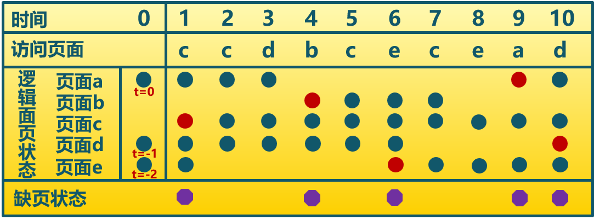
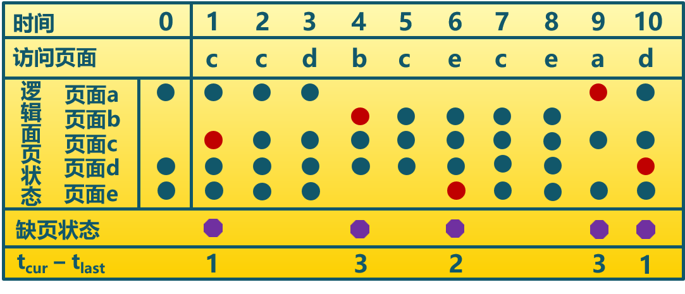

# Global Replacement

A global replacement policy considers **all unlocked pages** in main memory as candidates for replacement, regardless of which process owns a particular page.

* 全局置换算法要解决的问题
  * 进程在不同阶段的内存需求是变化的
  * 分配给进程的内存也需要在不同阶段有所变化
  * 全局置换算法需要确定分配给进程的物理页面数
  
* CPU 利用率与并发进程数的关系
  * 进程数少时，提高并发进程数可提高 CPU 利用率
  * 并发进程导致内存访问增加
  * 并发进程的内存访问降低了访存的局部性特征
  * 局部性特征的下降会导致缺页率上升和 CPU 利用率下降

## Working Set Strategy

### Working Set

The working set with parameter $\Delta$ for a process at virtual time $t$, which we designate as $W(t, \Delta)$, is **the set of pages of that process that have been referenced in the last $\Delta$ virtual time units**.**The variable $\Delta$ is a window of
virtual time over which the process is observed**. （当前时刻 $t$ 前的 $\Delta$ 时间窗口中的所有访问页面所组成的集合）

The working set size will be a non-decreasing function of the window size. The result is illustrated in Figure below, which shows a sequence of page references for a process.

Note that the larger the window size, the larger is the working set, which can be expressed in the following
relationship:
$$\mathrm{W}(t, \Delta+1) \supseteq \mathrm{W}(t, \Delta)$$
The working set is also a function of time. If a process executes over $\Delta$ time units and uses only a single page, $|W(t, \Delta)| =1$. A working set can also grow as large as the number of pages N of the process, if many different pages are rapidly
addressed and if the window size allows. Thus,
$$
1 \leq|\mathrm{W}(t, \Delta)| \leq \min (\Delta, N)
$$

Figure above indicates the way in which the working set size can vary over time for a fixed value of $\Delta$. For many programs, periods of relatively stable working set sizes alternate with periods of rapid change.  

* When a process first begins executing, it gradually builds up to a working set as it references new pages.
* Eventually by the principle of locality, the process should stabilize on a certain set of pages.
* Subsequent transient periods reflect a shift of the program to a new locality.
* During the transition phase, **some of the pages from the old locality remain with the window, causing a surge in the size of the working as new pages are referenced**.
* As the window slides past these page references, the working set size declines until it contains only those pages from the new locality.

### Resident Set

That portion of a process that is **actually in main memory** at a given
time. （在当前时刻，进程实际驻留在内存当中的页面集合）

* Resident Set 和 Working Set  的关系
  * Working Set 是进程在运行过程中**固有性质**
  * Resident Set 取决于系统分配给进程物理页面的数目和页面置换算法
* Resident Set 与 [Page Fault Rate](#page-fault-rate-pfr) 的关系
  * $\mathrm{Resident \space Set} \supseteq \mathrm{Working \space Set}$，缺页较少
  * Working Set 发生剧烈抖动时，缺页较多
  * 进程 Resident Set 大小达到一定数目后，PFF 不会显著下降

### Algorithm

#### Basic Idea

1. Monitor the working set of each process.
2. Periodically remove from the resident set of a process those pages that are not in its working set. This is essentially an LRU policy.
3. A process may execute only if its working set is in main memory (i.e., if its
resident set includes its working set).

#### Implementation

* 窗口大小$\tau$：当前时刻前 $\tau$ 个访问页面
* 访存链表
  * 访存时，换出不在工作集的页面，更新访存链表
  * 缺页时，换入页面，更新访存链表

#### Example

$\tau = 4$

## Page Fault Frequency Strategy

### Page Fault Rate (PFR)

The reciprocal of time between page faults is the page fault rate.

* 影响 PFR 的因素
  * 页面置换算法
  * 分配给进程的物理页面数目
  * 页面大小
  * 程序写法

### Algorithm

#### Basic Idea

* It requires **a use bit** to be associated with each page in memory. **The bit is set to 1 when that page is accessed**. When a page fault occurs, the OS notes the virtual time since the last page fault for that process; this could be done by maintaining a counter of page references.
* A threshold F is defined. If **the amount of time since the last page fault is less than F**, **then a page is added to the resident set** of the process.
* Otherwise, **discard all pages with a use bit of 0, and shrink the resident set accordingly**. At the same time, *reset the use bit on the remaining pages of the process to 0*.

#### Example

The threshold F=2

## Thrashing

A phenomenon in virtual memory schemes, in which the processor **spends most of its time swapping pieces rather than executing instructions**.

* 产生原因：随着驻留内存进程数的增加，由于页面数有限，导致缺页现象频繁发生。
* 操作系统需要在并发水平和缺页率间达到一个平衡，即选择一个适当进程数目和进程需要的页面数

## [FBR](./local_replacement.md#fbr)

## Local vs. Global Replacement

Replacement algorithms can be local or global.

* When a process incurs a page fault, a local page replacement algorithm selects for replacement some page that belongs to that same process (or a group of processes sharing a memory partition).
* A global replacement algorithm is free to select any page in memory.
* With a local replacement strategy, the number of frames allocated to a process does not change.
* With global replacement, a process may happen to select only frames allocated to other processes, thus increasing the number of frames allocated to it (assuming that other processes do not choose its frames for replacement).
* Global replacement generally results in greater system throughput and is therefore the more common method.
