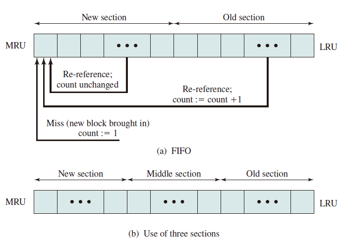

# Local Replacement

## Introduction

* 置换算法实现的功能：当出现缺页异常，需调入新页面而内存已满时，置换算法**选择被置换的物理页面**
* 设计目标
  * 尽可能**减少页面调入调出的次数**
  * 把短期内不再访问的页面调出
* 页面锁定 (frame locking)
  * 描述必须常驻内存的逻辑页面
  * 操作系统的关键部分
  * 要求响应速度的代码和数据
  * 页表中的锁定标志位 (lock bit)
* 评价方法
  * 模拟页面置换行为，记录产生缺页的次数
  * 更少的缺页次数，更好的性能

## Algorithms

### Optimal (OPT)

* Selects for replacement that page for which **the time to the next reference is the longest** (based on future information), and results in the fewest number of page faults.
* Impossible to implement
* Benchmark algorithm (a standard to judge real-world
algorithms)

### Least recently used (LRU)

* Replaces the page in memory that **has not been referenced for the long time** (based on past information). By the principle of locality, this should be the page least likely to be referenced in the near future.
* Does nearly as well as the optimal policy.
* Implement by linked list or stack, ordered by visit time, with high time complexity.
* LRU can be degenerated into FIFO if a block have not been referenced since it was fetched into memory.

### First-in-first-out (FIFO)

* **Replacing the page that has been in memory the longest**: A page fetched into memory a long time ago may have now fallen out of use
* Process as a circular buffer
* May cause *belady anomaly*
* Easy to implement but performs poorly ([Belady Anomaly](#belady-anomaly))

### Clock

* Organize frames in a circular buffer with which a pointer is associated.
* First loaded or subsequently referenced, use bit = 1.
* When replace, find a frame with use bit = 0, and reset use bit of frames that each scan encounters to 0.
* If all of the frames have a use bit of 1, then the pointer will make one complete cycle through the buffer, setting all the use bits to 0, and stop at its original position, replacing the page in that frame.
* An implementation of LRU using FIFO mechanism.

### Improved Clock

The clock algorithm can be made more powerful by increasing the number of bits that it employs like

1. Not accessed recently, not modified (u = 0; m = 0)
2. Accessed recently, not modified (u = 1; m = 0)
3. Not accessed recently, modified (u = 0; m = 1)
4. Accessed recently, modified (u = 1; m = 1)

* Beginning at the current position of the pointer, scan the frame buffer. During
this scan, **make no changes to the use bit**. The first frame encountered with
(u = 0; m = 0) is selected for replacement.
* If step 1 fails, scan again, looking for the frame with (u = 0; m = 1). The first
such frame encountered is selected for replacement. During this scan, **set the
use bit to 0 on each frame that is bypassed**.
* If step 2 fails, the pointer should have returned to its original position and all
of the frames in the set will have a use bit of 0. Repeat step 1 and, if necessary,
step 2. This time, a frame will be found for the replacement.

### Least Frequently Used

* Replace the block in the set that has **experienced the fewest references**.
* could be implemented by associating a counter with each block.
* When a block is brought in, it is assigned a count of 1; with each reference to the block, its count is incremented by 1. When replacement is required, **the block with the smallest count is selected**.
* Make poor replacement choices when certain blocks are referenced relatively infrequently overall, but frequently in some short intervals of repeated references due to locality, thus building up high reference counts.

#### FBR

* To overcome this difficulty with LFU, a technique known as **frequency-based replacement** is proposed.
  * A simple version in the Figure (a): The blocks are organized in a stack and the top part of the stack is designated for the new section, which means the referenced block is moved to the top of the new section if there is a cache hit. Besides, if the block is not in the new section (i.e. the old section), its reference count increments by 1.
  * A further refinement addresses this problem, seeing Figure (b): Divide the stack into three sections (new, middle and old). As before, reference counts are not incremented on blocks in the new section. However, only blocks in the old section are eligible for replacement. Supposing a sufficiently large middle section, this allows relatively frequently referenced blocks a chance to build uo their counts before becoming eligible for replacement (buffer section). Simulation studies indicates that this refined policy is significantly better than LRU or LFU. Note that sizes of new, middle and old sections are hyperparameters which should be fine tuned in daily use.

### Example

#### OPT/LRU/FIFO/CLOCK

#### Improved Clock

|Time|0|1|2|3|4|5|6|7|8|9|10|
|:--:|:--:|:--:|:--:|:--:|:--:|:--:|:--:|:--:|:--:|:--:|:--:|
|Request||c|aw|d|bw|e|b|aw|b|c|d|
|Frame 0 (u,m)|*a(00)*|*a(00)*|***a(11)***|*a(11)*|*a(11)*|a(01)|a(01)|**a(11)**|a(11)|*a(11)*|a(01)|
|Frame 1 (u,m)|b(00)|b(00)|b(00)|b(00)|**b(11)**|b(01)|**b(11)**|b(11)|**b(11)**|b(11)|b(01)|
|Frame 2 (u,m)|c(00)|**c(10)**|c(10)|c(10)|c(10)|**e(10)**|e(10)|e(10)|e(10)|e(10)|**d(10)**|
|Frame 3 (u,m)|d(00)|d(00)|d(00)|**d(10)**|d(10)|*d(00)*|*d(00)*|*d(00)*|*d(00)*|**c(10)**|*c(00)*|
|Page Fault||||||√||||√|√|

#### LFU

Notice that ax means a has been referenced for x times.

|Time|0|1|2|3|4|5|6|7|8|9|10|
|:--:|:--:|:--:|:--:|:--:|:--:|:--:|:--:|:--:|:--:|:--:|:--:|
|Request||c7|a1|d14|b5|e18|b1|a19|b20|c20|d17|
|Frame 0|a8|a8|**a9**|a9|a9|**e18**|e18|e18|e18|e18|**d17**|
|Frame 1|b5|b5|b5|b5|**b10**|b10|**b11**|**a19**|a19|a19|a19|
|Frame 2|c6|**c13**|c13|c13|c13|c13|c13|c13|**b20**|b20|b20|
|Frame 3|d2|d2|d2|**d16**|d16|d16|d16|d16|d16|**c20**|c20|
|Page Fault||||||√||√|√|√|√|

## Belady Anomaly

Belady anomaly is the phenomenon in which **increasing the number of page frames** results in **an increase in the number of page faults** for certain memory access patterns. This phenomenon is commonly experienced when using the first-in first-out (FIFO) page replacement algorithm.  

In **FIFO**, the page fault **may or may not increase** as the page frames increase, but in **Optimal and stack-based algorithms like LRU**, as the page frames increase the page fault **decreases**.
