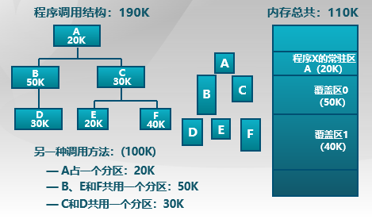
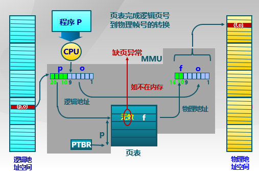

# Preliminary Concepts

## Overlay

* 解释：应用程序**手动**把需要的指令和数据保存在内存中
* 目标：在较小的可用内存中运行较大的程序
* 特点：
  * 只能发生在没有调用关系的模块间
  * **程序员**必须给出模块间的逻辑覆盖结构
  * 发生在运行程序的内部模块间
* 方法：根据程序逻辑结构，将程序划分为若干**功能相对独立的模块**，将不会同时执行的模块**共享同一块内存区域**。
  * 必要部分（常用功能）的代码和数据常驻内存
  * 可选部分（不常用功能）放在其他程序模块中，只在需要用到的时候装入内存
  * 不存在调用关系模块可共享一块内存区域
* 示例  
  

* 不足
  * 增加编程困难
    * 需要划分功能模块并确定模块间的覆盖关系
    * 增加了编程的复杂度
  * 增加执行时间
    * 从外存装入覆盖模块
    * 时间换空间

## Swapping

* 目标：增加正在运行或需要运行的程序的内存
* 特点：
  * 以进程为单位
  * 不需要模块间的逻辑覆盖结构
  * 发生在内存进程间
* 实现方法：
  * 可将暂时不能运行的程序放到外存
  * 换入换出的基本单位：整个进程的地址空间
  * 换出 (swap out)：把一个进程的整个地址空间保存到外存
  * 换入 (swap in)：将外存中某进程的地址空间读入到内存
* 问题与解答
  * 何时需要交换：当内存空间不够或又不够的可能时换出
  * 交换区大小：存放所有用户进程的所有内存映像的拷贝
  * 换出后再换入时要放在原处吗（重定位问题）：采用动态地址映射的方法

## The Principle of Locality

Intuitively, the principle of locality makes sense. Consider the following line of
reasoning:

1. Except for **branch and call instructions**, which constitute only a small fraction
of all program instructions, program execution is sequential. Hence, in most
cases, the next instruction to be fetched immediately follows the last instruction
fetched.
2. It is rare to have a long uninterrupted sequence of procedure calls followed by
the corresponding sequence of returns. Rather, a program remains confined to a
rather narrow window of procedure-invocation depth. Thus, over a short period
of time, references to instructions tend to **be localized to a few procedures**.

3. Most iterative constructs consist of **a relatively small number of instructions repeated many times**. For the duration of the iteration, computation is therefore
confined to a small contiguous portion of a program.

4. In many programs, much of the computation involves processing data structures, such as arrays or sequences of records. In many cases, **successive references to these data structures** will be to closely located data items.

To summarize, the principle of locality states that program and data references within a process tend to cluster. Hence, the assumption that only a few pieces of a process will be needed over a short period of time is valid. Also, it should be possible to make intelligent guesses about which pieces of a process will be needed in the near future, which avoids thrashing.

### Example

```c++
for (int j = 0; j < 1024; j++)
  for (int i = 0; i < 1024; i++) A[i][j] = 0;

for (int i = 0; i < 1024; i++)
  for (int j = 0; j < 1024; j++) A[i][j] = 0;
```

In the first code, $1024 \times 1024$ page faults occur, and in the second code, $1024$ page faults occur.

## Virtual Storage

* 思路
  * 把不常用的部分内存块暂存到外
* 原理
  * 装载程序时
    * 只将当前指令执行需要的部分页面或段载入内存
  * 指令执行中需要的指令或数据不在内存（即缺页或缺段）时
    * 处理器通知操作系统将相应的页或段调入内存
  * 操作系统将内存中暂时不用的页或段保存到外存

* 实现方式
  * 虚拟页式存储
  * 虚拟段式存储
* 基本特征
  * 不连续性
    * 物理内存分配非连续
    * 虚拟地址空间使用非连续
  * 大用户空间
    * 提供给用户的虚拟内存可大于实际的物理内存
  * 部分交换
    * 虚拟存储只对部分虚拟地址空间进行调入和调出

## Virtual Pages

在[页式存储管理](../memory_management/noncontiguous_memory_allocation.md#paging)的增加请求掉和和页面替换

* 当用户程序装载到内存运行时，只装入部分页面就启动程序运行
* 进程在运行中发现有需要的代码或数据不在内存中就向系统发出缺页异常请求
* 操作系统在处理缺页异常时，将外存中的相应页面载入内存使得进程能继续执行


### [Page Table Entries](../memory_management/noncontiguous_memory_allocation.md#page-table-entries)

## Page Faults

### Procedures

1. 在内存中有空闲物理帧时，分配一物理帧 f，转第 5 步
2. 根据页面替换算法选择将被替换的物理帧对应的逻辑页 q
3. 若 q 被修改过则将它写回内存
4. 修改 q 的 present bit 为 0
5. 将需要访问的页 p 载入物理帧 f
6. 修改 p 的 present bit 为 1，帧号为 f
7. 重新执行产生缺页的指令

### Effective Memory-access Time

* Hit Ratio: The percentage of times that a particular page number is found in the TLB.

* TLB Hit: The page is found in TLB
* TLB Miss: The page is not found in the TLB so that accessing memory to get the page table entries and the data is needed.

$$\begin{aligned}
  \mathrm{EAT} &= \mathrm{TLB \space miss \space time} \times (1 - \mathrm{hit \space ratio}) + \mathrm{TLB \space hit \space time} \times \mathrm{hit \space ratio} \\
  &= (\mathrm{TLB \space search \space time} + 2 \times \mathrm{memory \space access \space time}) \times (1 - \mathrm{hit \space ratio}) + (\mathrm{TLB \space search \space time} + \mathrm{memory \space access \space time}) \times \mathrm{hit \space ratio}
\end{aligned}$$

#### Example

* TLB lookup takes 5 nano sec.  
* Memory access time is 100 nano sec.
* Hit ratio is 80%.

What is the effective memory access time?
$$\mathrm{EAT} = (5+100 \times 2) \times .2 + (5+100) \times .8 = 125 \mathrm{\space nano \space sec}$$  
