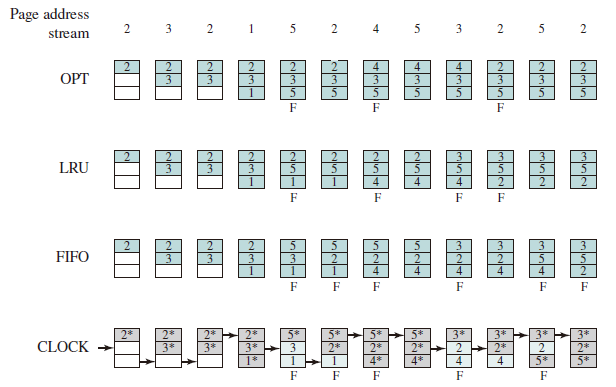

# Replacement Policy

## Basic Algorithms 

### Optimal 
* Selects for replacement that page for which the time to the next reference is the longest.
* Impossible to implement
* Benchmark algorithm
### Least recently used (LRU)
* Replaces the page in memory that has not been referenced for the long time.
* Does nearly as well as the optimal policy.
* Implement by linked list or stack, ordered by visit time, with high time complexity.

### First-in-first-out (FIFO)
* Process as a circular buffer
* May cause *belady anomaly*
* Easy to implement

### Clock
* Organize frames in a circular buffer.
* First loaded or subsequently referenced, use bit = 1.
* When replace, find a frame with use bit = 0, and reset use bit of frames that each scan encounters to 0.
* If all of the frames have a use bit of 1, then the pointer will make one complete cycle through the buffer, setting all the use bits to 0, and stop at its original position, replacing the page in that frame.
* An implementation of LRU using FIFO mechanism.

### Example

## Unfrequent Algorithms

### Improved Clock

1. Not accessed recently, not modified (u = 0; m = 0)
2. Accessed recently, not modified (u = 1; m = 0)
3. Not accessed recently, modified (u = 0; m = 1)
4. Accessed recently, modified (u = 1; m = 1)

* Beginning at the current position of the pointer, scan the frame buffer. During
this scan, make no changes to the use bit. The first frame encountered with
(u = 0; m = 0) is selected for replacement.
* If step 1 fails, scan again, looking for the frame with (u = 0; m = 1). The first
such frame encountered is selected for replacement. During this scan, set the
use bit to 0 on each frame that is bypassed.
* If step 2 fails, the pointer should have returned to its original position and all
of the frames in the set will have a use bit of 0. Repeat step 1 and, if necessary,
step 2. This time, a frame will be found for the replacement.

In breif, the transitions of each state are shown in the table below, 

| Use Bit | Modify Bit| Next State |
| :---: | :---: | :---: |
| 0 | 0 | swap |
| 0 | 1 | 0 0 |
| 1 | 0 | 0 0 |
| 1 | 1 | 0 1 |

### Least Frequently Used
* Replace the block in the set that has experienced the fewest references.
* could be implemented by associating a counter with each block.
* When a block is brought in, it is assigned a count of 1; with each reference to the block, its count is incremented by 1. When replacement is required, the block with the smallest count is selected.
* Make poor replacement choices when certain blocks are referenced relatively infrequently overall, but frequently in some short intervals.
## Belady Anamoly

Conficts between the FIFO algorithm and the memory dynamic feature.

